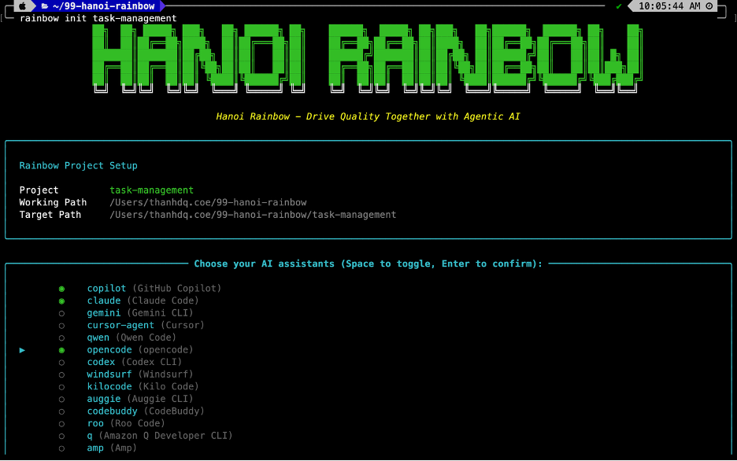

<div align="center">

# 🌈 Hanoi Rainbow

### *Drive Quality Together with AI-Powered Framework*

**Stop guessing. Start specifying.**  
Turn your ideas into production-ready applications through clear specifications, not trial-and-error coding.

[](https://github.com/dauquangthanh/hanoi-rainbow/actions/workflows/release.yml)
[](https://github.com/dauquangthanh/hanoi-rainbow/stargazers)
[](https://github.com/dauquangthanh/hanoi-rainbow/blob/main/LICENSE)
[](https://dauquangthanh.github.io/hainoi-rainbow/)

</div>

---

## Table of Contents

- [🤔 What is Spec-Driven Development?](#-what-is-spec-driven-development)
- [⚡ Get Started](#-get-started)
- [🤖 Supported AI Agents](#-supported-ai-agents)
- [🔧 Rainbow CLI Reference](#-rainbow-cli-reference)
- [📚 Core Philosophy](#-core-philosophy)
- [🌟 Development Phases](#-development-phases)
- [🔧 Prerequisites](#-prerequisites)
- [📖 Learn More](#-learn-more)
- [📋 Detailed Process](#-detailed-process)
- [🔍 Troubleshooting](#-troubleshooting)
- [👥 Maintainers](#-maintainers)
- [💬 Support](#-support)
- [🙏 Acknowledgements](#-acknowledgements)
- [📄 License](#-license)

## 💡 What is Spec-Driven Development?

**Traditional approach:** Write code first, figure it out as you go.  
**Spec-Driven approach:** Define what you want first, then let AI build it right.

For decades, we treated specifications as throwaway notes—just a formality before the "real" coding began. Spec-Driven Development flips this around: **your specification becomes the blueprint** that directly generates working code, not just a suggestion.

> **Think of it like architecture:** You wouldn't build a house without blueprints. Why build software without clear specifications?

## 🚀 Quick Start

### Install Rainbow CLI

**Recommended: Install once, use everywhere**

```bash
uv tool install rainbow-cli --from git+https://github.com/dauquangthanh/hanoi-rainbow.git
```

Then use it anywhere:

```bash
rainbow init <PROJECT_NAME>
rainbow check
```

<p align="center">
  
</p>

**Need to upgrade?** See the [Upgrade Guide](./docs/upgrade.md) or run:

```bash
uv tool install rainbow-cli --force --from git+https://github.com/dauquangthanh/hanoi-rainbow.git
```

<details>
<summary><strong>Alternative: Run without installing</strong></summary>

```bash
uvx --from git+https://github.com/dauquangthanh/hanoi-rainbow.git rainbow init <PROJECT_NAME>
```

**Why install?**

- ✅ Available everywhere in your terminal
- ✅ Easy to upgrade with `uv tool upgrade`
- ✅ Cleaner than shell aliases
- ✅ Better tool management

</details>

---

### Your First Project in 8 Steps

> **💡 Automatic Version Control:** All Rainbow commands automatically generate appropriate git commit messages and commit changes upon completion. Commands use semantic commit prefixes (`docs:`, `feat:`, `test:`, `chore:`) to maintain a clear project history.

#### 1️⃣ **Set Project Rules**

Launch your AI assistant in the project. You'll see `/rainbow.*` commands available.

Create your project's guiding principles:

```bash
/rainbow.regulate Create principles for code quality, testing, user experience, and performance
```

#### 2️⃣ **Write the Specification**

Describe **what** you want to build and **why** (not the tech stack yet):

```bash
/rainbow.specify Build a photo organizer with albums grouped by date. 
Users can drag-and-drop albums to reorganize them. Albums show photos in a tile view. 
No nested albums allowed.
```

#### 3️⃣ **Design System Architecture** *(Optional)*

Document your system architecture once per product:

```bash
/rainbow.architect Create C4 diagrams, document tech stack decisions and architecture patterns
```

#### 4️⃣ **Set Coding Standards** *(Optional)*

Create coding standards for your team:

```bash
/rainbow.standardize Define naming conventions, file organization, and best practices
```

#### 5️⃣ **Create Implementation Plan**

Now specify **how** to build it (tech stack and architecture):

```bash
/rainbow.design Use Vite with vanilla HTML, CSS, and JavaScript. 
Keep libraries minimal. Store metadata in local SQLite. No image uploads.
```

#### 6️⃣ **Break Down Tasks**

Generate an actionable task list:

```bash
/rainbow.taskify
```

#### 7️⃣ **Build It**

Execute all tasks automatically:

```bash
/rainbow.implement
```

#### 8️⃣ **Test & Iterate**

Run your application and fix any issues. Your AI assistant will help debug.

---

**Want more details?** Read our [complete guide](./spec-driven.md).

## 🤖 Supported AI Agents

| Agent                                                     | Support | Notes                                             |
|-----------------------------------------------------------|---------|---------------------------------------------------|
| [Amazon Q Developer CLI](https://aws.amazon.com/developer/learning/q-developer-cli/) | ⚠️ | Amazon Q Developer CLI [does not support](https://github.com/aws/amazon-q-developer-cli/issues/3064) custom arguments for slash commands. |
| [Amp](https://ampcode.com/)                               | ✅ | |
| [Auggie CLI](https://docs.augmentcode.com/cli/overview)   | ✅ |                                                   |
| [Claude Code](https://www.anthropic.com/claude-code)      | ✅ |                                                   |
| [CodeBuddy CLI](https://www.codebuddy.ai/cli)             | ✅ |                                                   |
| [Codex CLI](https://github.com/openai/codex)              | ✅ |                                                   |
| [Cursor](https://cursor.sh/)                              | ✅ |                                                   |
| [Gemini CLI](https://github.com/google-gemini/gemini-cli) | ✅ |                                                   |
| [GitHub Copilot](https://code.visualstudio.com/)          | ✅ |                                                   |
| [IBM Bob](https://www.ibm.com/products/bob)               | ✅ | IDE-based agent with slash command support |
| [Jules](https://jules.google.com/)                        | ✅ | |
| [Kilo Code](https://github.com/Kilo-Org/kilocode)         | ✅ |                                                   |
| [opencode](https://opencode.ai/)                          | ✅ |                                                   |
| [Qwen Code](https://github.com/QwenLM/qwen-code)          | ✅ |                                                   |
| [Roo Code](https://roocode.com/)                          | ✅ |                                                   |
| [SHAI (OVHcloud)](https://github.com/ovh/shai)            | ✅ | |
| [Windsurf](https://windsurf.com/)                         | ✅ |                                                   |

## 🔧 Rainbow CLI Reference

The `rainbow` command supports the following options:

### Commands

| Command     | Description                                                    |
|-------------|----------------------------------------------------------------|
| `init`      | Initialize a new Rainbow project from the latest template      |
| `check`     | Check for installed tools (`git`, `claude`, `gemini`, `code`/`code-insiders`, `cursor-agent`, `windsurf`, `qwen`, `opencode`, `codex`, `kilocode`, `auggie`, `roo`, `codebuddy`, `amp`, `shai`, `q`, `bob`, `jules`, `qoder`, `antigravity`) |
| `version`   | Display CLI version, template version, and system information  |

### `rainbow init` Arguments & Options

| Argument/Option        | Type     | Description                                                                  |
|------------------------|----------|------------------------------------------------------------------------------|
| `<project-name>`       | Argument | Name for your new project directory (optional if using `--here`, or use `.` for current directory) |
| `--ai`                 | Option   | AI assistant(s) to use. Can be a single agent or comma-separated list (e.g., `claude,gemini,copilot`). Valid options: `claude`, `gemini`, `copilot`, `cursor-agent`, `qwen`, `opencode`, `codex`, `windsurf`, `kilocode`, `auggie`, `roo`, `codebuddy`, `amp`, `shai`, `q`, `bob`, `jules`, `qoder`, `antigravity`. If not specified, an interactive multi-select menu will appear |
| `--script`             | Option   | Script variant to use: `sh` (bash/zsh) or `ps` (PowerShell)                 |
| `--ignore-agent-tools` | Flag     | Skip checks for AI agent tools like Claude Code                             |
| `--no-git`             | Flag     | Skip git repository initialization                                          |
| `--here`               | Flag     | Initialize project in the current directory instead of creating a new one   |
| `--force`              | Flag     | Force merge/overwrite when initializing in current directory (skip confirmation) |
| `--skip-tls`           | Flag     | Skip SSL/TLS verification (not recommended)                                 |
| `--debug`              | Flag     | Enable detailed debug output for troubleshooting                            |
| `--github-token`       | Option   | GitHub token for API requests (or set GH_TOKEN/GITHUB_TOKEN env variable)  |

### Examples

```bash
# Basic project initialization
rainbow init my-project

# Initialize with specific AI assistant
rainbow init my-project --ai claude

# Initialize with multiple AI assistants (comma-separated)
rainbow init my-project --ai claude,gemini,copilot

# Initialize with Cursor support
rainbow init my-project --ai cursor-agent

# Initialize with multiple agents including Windsurf and Amp
rainbow init my-project --ai windsurf,amp,claude

# Initialize with SHAI support
rainbow init my-project --ai shai

# Initialize with IBM Bob support
rainbow init my-project --ai bob

# Initialize with PowerShell scripts (Windows/cross-platform)
rainbow init my-project --ai copilot --script ps

# Initialize in current directory
rainbow init . --ai copilot
# or use the --here flag
rainbow init --here --ai copilot

# Force merge into current (non-empty) directory without confirmation
rainbow init . --force --ai copilot
# or
rainbow init --here --force --ai copilot

# Skip git initialization
rainbow init my-project --ai gemini --no-git

# Enable debug output for troubleshooting
rainbow init my-project --ai claude --debug

# Use GitHub token for API requests (helpful for corporate environments)
rainbow init my-project --ai claude --github-token ghp_your_token_here

# Check system requirements
rainbow check

# Display version and system information
rainbow version
```

### Available Slash Commands

After running `rainbow init`, your AI coding agent will have access to these slash commands for structured development:

> **💡 Automatic Commits:** All commands automatically generate semantic commit messages and commit their changes upon completion, maintaining a clear project history without manual intervention.

#### Core Workflow Commands

Essential commands for the Spec-Driven Development workflow:

| Command                  | Description                                                           | Auto Commit Prefix |
|--------------------------|-----------------------------------------------------------------------|--------------------|
| `/rainbow.regulate`      | Create or update project governing principles and development guidelines | `docs:` |
| `/rainbow.specify`       | Define what you want to build (requirements and user stories)        | `docs:` |
| `/rainbow.design`        | Create technical implementation plans with your chosen tech stack     | `docs:` |
| `/rainbow.taskify`       | Generate actionable task lists for implementation                     | `docs:` |
| `/rainbow.implement`     | Execute all tasks to build the feature according to the plan         | `feat:`, `fix:`, `test:` (context-dependent) |

#### Product-Level Commands

Commands for comprehensive product-wide documentation (run once per product, not per feature):

| Command                      | Description                                                           | Auto Commit Prefix |
|------------------------------|-----------------------------------------------------------------------|--------------------|
| `/rainbow.architect`         | Create comprehensive system architecture documentation for the entire product | `docs:` |
| `/rainbow.standardize`       | Create comprehensive coding standards and conventions documentation | `docs:` |
| `/rainbow.design-e2e-test`   | Design comprehensive end-to-end test specifications for the entire product | `test:` |
| `/rainbow.perform-e2e-test`  | Execute end-to-end tests and generate detailed test result reports | `test:` |

#### Quality & Enhancement Commands

Additional commands for enhanced quality, validation, and project management:

| Command                  | Description                                                           | Auto Commit Prefix |
|--------------------------|-----------------------------------------------------------------------|--------------------|
| `/rainbow.clarify`       | Clarify underspecified areas (recommended before `/rainbow.design`; formerly `/quizme`) | `docs:` |
| `/rainbow.analyze`       | Cross-artifact consistency & coverage analysis (run after `/rainbow.taskify`, before `/rainbow.implement`) | `docs:` |
| `/rainbow.checklist`     | Generate custom quality checklists that validate requirements completeness, clarity, and consistency | `docs:` |
| `/rainbow.tasks-to-issues` | Convert existing tasks into actionable GitHub issues with dependency tracking | `chore:` |
| `/rainbow.tasks-to-ado`  | Convert existing tasks into actionable Azure DevOps work items with dependency tracking | `chore:` |

#### Mainframe/Midrange Modernization Commands

Commands for systematic legacy system migration and modernization:

| Command                  | Description                                                           | Auto Commit Prefix |
|--------------------------|-----------------------------------------------------------------------|--------------------|
| `/rainbow.assess-legacy` | Analyze existing legacy systems (COBOL, RPG, JCL) to understand current state before modernization | `docs:` |
| `/rainbow.map-business-logic` | Extract and document business rules from legacy code for reimplementation | `docs:` |
| `/rainbow.design-data-migration` | Create comprehensive data migration strategy from legacy databases (DB2, IMS, VSAM) to modern data stores | `docs:` |
| `/rainbow.convert-batch` | Design modern equivalents for mainframe batch processing (JCL → Kubernetes/serverless/streaming) | `docs:` |
| `/rainbow.design-screen-migration` | Convert green-screen/5250 interfaces to modern web/mobile UI | `docs:` |
| `/rainbow.plan-strangler` | Create detailed strangler pattern implementation plan for phased migration | `docs:` |
| `/rainbow.validate-modernization` | Verify that modernized system matches legacy behavior and meets quality standards | `test:` |

#### Role-Based Agents

Specialized agents for specific team roles in your development workflow:

> **💡 Note:** All role-based agents automatically generate `docs:` prefixed commit messages and commit their deliverables upon completion.

| Agent                             | Description                                                           |
|----------------------------------|-----------------------------------------------------------------------|
| `/hanoi.business-analyst`      | Analyze business requirements, gather stakeholder needs, and create comprehensive business documentation |
| `/hanoi.product-owner`         | Define product vision, manage backlog, prioritize features, and create user stories |
| `/hanoi.system-architect`      | Design system architecture, make technology decisions, and create architectural documentation |
| `/hanoi.technical-leader`      | Provide technical leadership, code reviews, and guide engineering best practices |
| `/hanoi.software-engineer`     | Implement features, write code, and create technical documentation |
| `/hanoi.qa-engineer`           | Design test strategies, create test cases, and ensure quality standards |
| `/hanoi.devops-engineer`       | Design CI/CD pipelines, manage infrastructure, and automate deployment processes |
| `/hanoi.security-engineer`     | Conduct security assessments, identify vulnerabilities, and implement security measures |
| `/hanoi.ux-ui-designer`        | Design user interfaces, create wireframes, and ensure consistent user experience |
| `/hanoi.technical-writer`      | Create and maintain technical documentation, user guides, and API documentation |
| `/hanoi.scrum-master`          | Facilitate agile ceremonies, remove impediments, and support team collaboration |
| `/hanoi.legacy-analyst`        | Analyze mainframe/midrange codebases (COBOL, RPG, PL/I) to extract business logic and assess modernization complexity |
| `/hanoi.mainframe-architect`   | Design mainframe-to-cloud migration strategies and hybrid architectures |
| `/hanoi.data-migration-engineer` | Plan and execute data migrations from legacy databases to modern data platforms |
| `/hanoi.batch-modernization-engineer` | Convert mainframe batch processing (JCL) to modern batch architectures |
| `/hanoi.cobol-translator`      | Translate COBOL/RPG/PL/I business logic to modern languages while preserving exact behavior |
| `/hanoi.mainframe-tester`      | Test and validate modernized systems for functional equivalence and compliance |

### Environment Variables

| Variable         | Description                                                                                    |
|------------------|------------------------------------------------------------------------------------------------|
| `SPECIFY_FEATURE` | Override feature detection for non-Git repositories. Set to the feature directory name (e.g., `001-photo-albums`) to work on a specific feature when not using Git branches.<br/>**Must be set in the context of the agent you're working with prior to using `/rainbow.design` or follow-up commands. |

## 🎯 Why Spec-Driven Development?

Spec-Driven Development is built on these core principles:

| Principle | What It Means |
|-----------|---------------|
| **Intent First** | Define the "*what*" and "*why*" before the "*how*" |
| **Rich Specifications** | Create detailed specs with organizational principles and guardrails |
| **Step-by-Step Refinement** | Improve through multiple steps, not one-shot generation |
| **AI-Powered** | Use advanced AI to interpret specifications and generate implementations |

---

## 🌟 When to Use Spec-Driven Development

| Scenario | What You Can Do |
|----------|-----------------|
| **🆕 New Projects** | <ul><li>Start with high-level requirements</li><li>Generate complete specifications</li><li>Plan implementation steps</li><li>Build production-ready apps</li></ul> |
| **🔬 Exploration** | <ul><li>Try different solutions in parallel</li><li>Test multiple tech stacks</li><li>Experiment with UX patterns</li></ul> |
| **🔧 Existing Projects** | <ul><li>Add new features systematically</li><li>Modernize legacy code</li><li>Adapt processes to your needs</li></ul> |
| **🏢 Mainframe Modernization** | <ul><li>Assess legacy systems (COBOL, RPG, JCL)</li><li>Extract business logic from code</li><li>Plan data migration strategies</li><li>Modernize batch processing</li><li>Convert green-screen UIs</li><li>Implement strangler pattern migrations</li><li>Validate modernized systems</li></ul> |

---

## 🔬 What We're Exploring

Our experiments focus on making Spec-Driven Development work for real teams:

- **🔧 Tech Independence** - Build apps with any tech stack, proving this process works across languages and frameworks
- **🏢 Enterprise Ready** - Support organizational constraints: cloud providers, compliance requirements, design systems
- **👥 User Focused** - Build for different user needs and development styles (from exploratory coding to structured workflows)
- **🔄 Iterative & Creative** - Enable parallel exploration of solutions and robust workflows for modernization

---

## ⚙️ What You Need

Before you start, make sure you have:

- **Operating System:** Linux, macOS, or Windows
- **AI Assistant:** Any [supported agent](#-supported-ai-agents) (Claude, Gemini, Copilot, Cursor, etc.)
- **Package Manager:** [uv](https://docs.astral.sh/uv/)
- **Python:** [Version 3.11 or higher](https://www.python.org/downloads/)
- **Version Control:** [Git](https://git-scm.com/downloads)

> Having issues with an agent? [Open an issue](https://github.com/dauquangthanh/hanoi-rainbow/issues/new) so we can improve it.

## 📚 Learn More

**Workflows & Guides:**

- 🗺️ **[Workflows Overview](./docs/workflows.md)** - **Choose the right workflow for your project**
- 🌱 [Greenfield Workflow](./docs/greenfield-workflow.md) - Build new applications (2-4 weeks)
- 🏗️ [Brownfield Workflow](./docs/brownfield-workflow.md) - Add features to existing apps (1-2 weeks)
- 🔄 [Legacy Migration Workflow](./docs/legacy-migration-workflow.md) - Migrate from mainframe (4-12 weeks)
- 🏭 [Legacy Modernization Workflow](./docs/legacy-modernization-workflow.md) - Complete modernization (6-18 months)

**Deep Dives:**

- 📖 [Complete Spec-Driven Development Guide](./spec-driven.md) - Full methodology explained
- 🔍 [Step-by-Step Walkthrough](#-detailed-process) - Implementation details below

**Quick Links:**

- 💬 [Get Support](https://github.com/dauquangthanh/hanoi-rainbow/issues/new) - Ask questions or report issues
- 📄 [View License](./LICENSE) - MIT License
- 🌟 [Star on GitHub](https://github.com/dauquangthanh/hanoi-rainbow) - Support the project

---

## 📋 Detailed Process

<details>
<summary>Click to expand the detailed step-by-step walkthrough</summary>

You can use the Rainbow CLI to bootstrap your project, which will bring in the required artifacts in your environment. Run:

```bash
rainbow init <project_name>
```

Or initialize in the current directory:

```bash
rainbow init .
# or use the --here flag
rainbow init --here
# Skip confirmation when the directory already has files
rainbow init . --force
# or
rainbow init --here --force

rainbow init <project_name> --ai claude
rainbow init <project_name> --ai gemini
rainbow init <project_name> --ai copilot

# Or in current directory:
rainbow init . --ai claude
rainbow init . --ai codex

# or use --here flag
rainbow init --here --ai claude
rainbow init --here --ai codex

# Force merge into a non-empty current directory
rainbow init . --force --ai claude

# or
rainbow init --here --force --ai claude
```

The CLI will check if you have Claude Code, Gemini CLI, Cursor CLI, Qwen CLI, opencode, Codex CLI, or Amazon Q Developer CLI installed. If you do not, or you prefer to get the templates without checking for the right tools, use `--ignore-agent-tools` with your command:

```bash
rainbow init <project_name> --ai claude --ignore-agent-tools
```

### **STEP 1:** Establish project principles

Go to the project folder and run your AI agent. In our example, we're using `claude`.

You will know that things are configured correctly if you see the `/rainbow.regulate`, `/rainbow.specify`, `/rainbow.design`, `/rainbow.taskify`, and `/rainbow.implement` commands available.

The first step should be establishing your project's governing principles using the `/rainbow.regulate` command. This helps ensure consistent decision-making throughout all subsequent development phases:

```text
/rainbow.regulate Create principles focused on code quality, testing standards, user experience consistency, and performance requirements. Include governance for how these principles should guide technical decisions and implementation choices.
```

This step creates or updates the `memory/ground-rules.md` file with your project's foundational guidelines that the AI agent will reference during specification, planning, and implementation phases.

### **STEP 2:** Create project specifications

With your project principles established, you can now create the functional specifications. Use the `/rainbow.specify` command and then provide the concrete requirements for the project you want to develop.

>[!IMPORTANT]
>Be as explicit as possible about *what* you are trying to build and *why*. **Do not focus on the tech stack at this point**.

An example prompt:

```text
Develop Taskify, a team productivity platform. It should allow users to create projects, add team members,
assign tasks, comment and move tasks between boards in Kanban style. In this initial phase for this feature,
let's call it "Create Taskify," let's have multiple users but the users will be declared ahead of time, predefined.
I want five users in two different categories, one product manager and four engineers. Let's create three
different sample projects. Let's have the standard Kanban columns for the status of each task, such as "To Do,"
"In Progress," "In Review," and "Done." There will be no login for this application as this is just the very
first testing thing to ensure that our basic features are set up. For each task in the UI for a task card,
you should be able to change the current status of the task between the different columns in the Kanban work board.
You should be able to leave an unlimited number of comments for a particular card. You should be able to, from that task
card, assign one of the valid users. When you first launch Taskify, it's going to give you a list of the five users to pick
from. There will be no password required. When you click on a user, you go into the main view, which displays the list of
projects. When you click on a project, you open the Kanban board for that project. You're going to see the columns.
You'll be able to drag and drop cards back and forth between different columns. You will see any cards that are
assigned to you, the currently logged in user, in a different color from all the other ones, so you can quickly
see yours. You can edit any comments that you make, but you can't edit comments that other people made. You can
delete any comments that you made, but you can't delete comments anybody else made.
```

After this prompt is entered, you should see Claude Code kick off the planning and spec drafting process. Claude Code will also trigger some of the built-in scripts to set up the repository.

Once this step is completed, you should have a new branch created (e.g., `001-create-taskify`), as well as a new specification in the `specs/001-create-taskify` directory.

The produced specification should contain a set of user stories and functional requirements, as defined in the template.

At this stage, your project folder contents should resemble the following:

```text
└── .rainbow
    ├── memory
    │  └── ground-rules.md
    ├── scripts
    │  ├── check-prerequisites.sh
    │  ├── common.sh
    │  ├── create-new-feature.sh
    │  ├── setup-plan.sh
    │  └── update-claude-md.sh
    ├── specs
    │  └── 001-create-taskify
    │      └── spec.md
    └── templates
        ├── plan-template.md
        ├── spec-template.md
        └── tasks-template.md
```

### **STEP 3:** Functional specification clarification (required before planning)

With the baseline specification created, you can go ahead and clarify any of the requirements that were not captured properly within the first shot attempt.

You should run the structured clarification workflow **before** creating a technical plan to reduce rework downstream.

Preferred order:

1. Use `/rainbow.clarify` (structured) – sequential, coverage-based questioning that records answers in a Clarifications section.
2. Optionally follow up with ad-hoc free-form refinement if something still feels vague.

If you intentionally want to skip clarification (e.g., spike or exploratory prototype), explicitly state that so the agent doesn't block on missing clarifications.

Example free-form refinement prompt (after `/rainbow.clarify` if still needed):

```text
For each sample project or project that you create there should be a variable number of tasks between 5 and 15
tasks for each one randomly distributed into different states of completion. Make sure that there's at least
one task in each stage of completion.
```

You should also ask Claude Code to validate the **Review & Acceptance Checklist**, checking off the things that are validated/pass the requirements, and leave the ones that are not unchecked. The following prompt can be used:

```text
Read the review and acceptance checklist, and check off each item in the checklist if the feature spec meets the criteria. Leave it empty if it does not.
```

It's important to use the interaction with Claude Code as an opportunity to clarify and ask questions around the specification - **do not treat its first attempt as final**.

### **STEP 4:** Generate a plan

You can now be specific about the tech stack and other technical requirements. You can use the `/rainbow.design` command that is built into the project template with a prompt like this:

```text
We are going to generate this using .NET Aspire, using Postgres as the database. The frontend should use
Blazor server with drag-and-drop task boards, real-time updates. There should be a REST API created with a projects API,
tasks API, and a notifications API.
```

The output of this step will include a number of implementation detail documents, with your directory tree resembling this:

```text
.
├── CLAUDE.md
├── memory
│  └── ground-rules.md
├── scripts
│  ├── check-prerequisites.sh
│  ├── common.sh
│  ├── create-new-feature.sh
│  ├── setup-plan.sh
│  └── update-claude-md.sh
├── specs
│  └── 001-create-taskify
│      ├── contracts
│      │  ├── api-spec.json
│      │  └── signalr-spec.md
│      ├── data-model.md
│      ├── plan.md
│      ├── quickstart.md
│      ├── research.md
│      └── spec.md
└── templates
    ├── CLAUDE-template.md
    ├── plan-template.md
    ├── spec-template.md
    └── tasks-template.md
```

Check the `research.md` document to ensure that the right tech stack is used, based on your instructions. You can ask Claude Code to refine it if any of the components stand out, or even have it check the locally-installed version of the platform/framework you want to use (e.g., .NET).

Additionally, you might want to ask Claude Code to research details about the chosen tech stack if it's something that is rapidly changing (e.g., .NET Aspire, JS frameworks), with a prompt like this:

```text
I want you to go through the implementation plan and implementation details, looking for areas that could
benefit from additional research as .NET Aspire is a rapidly changing library. For those areas that you identify that
require further research, I want you to update the research document with additional details about the specific
versions that we are going to be using in this Taskify application and spawn parallel research tasks to clarify
any details using research from the web.
```

During this process, you might find that Claude Code gets stuck researching the wrong thing - you can help nudge it in the right direction with a prompt like this:

```text
I think we need to break this down into a series of steps. First, identify a list of tasks
that you would need to do during implementation that you're not sure of or would benefit
from further research. Write down a list of those tasks. And then for each one of these tasks,
I want you to spin up a separate research task so that the net results is we are researching
all of those very specific tasks in parallel. What I saw you doing was it looks like you were
researching .NET Aspire in general and I don't think that's gonna do much for us in this case.
That's way too untargeted research. The research needs to help you solve a specific targeted question.
```

>[!NOTE]
>Claude Code might be over-eager and add components that you did not ask for. Ask it to clarify the rationale and the source of the change.

### **STEP 5:** Have Claude Code validate the plan

With the plan in place, you should have Claude Code run through it to make sure that there are no missing pieces. You can use a prompt like this:

```text
Now I want you to go and audit the implementation plan and the implementation detail files.
Read through it with an eye on determining whether or not there is a sequence of tasks that you need
to be doing that are obvious from reading this. Because I don't know if there's enough here. For example,
when I look at the core implementation, it would be useful to reference the appropriate places in the implementation
details where it can find the information as it walks through each step in the core implementation or in the refinement.
```

This helps refine the implementation plan and helps you avoid potential blind spots that Claude Code missed in its planning cycle. Once the initial refinement pass is complete, ask Claude Code to go through the checklist once more before you can get to the implementation.

You can also ask Claude Code (if you have the [GitHub CLI](https://docs.github.com/en/github-cli/github-cli) installed) to go ahead and create a pull request from your current branch to `main` with a detailed description, to make sure that the effort is properly tracked.

>[!NOTE]
>Before you have the agent implement it, it's also worth prompting Claude Code to cross-check the details to see if there are any over-engineered pieces (remember - it can be over-eager). If over-engineered components or decisions exist, you can ask Claude Code to resolve them. Ensure that Claude Code follows the [ground rules](base/memory/ground-rules.md) as the foundational piece that it must adhere to when establishing the plan.

### **STEP 6:** Generate task breakdown with /rainbow.taskify

With the implementation plan validated, you can now break down the plan into specific, actionable tasks that can be executed in the correct order. Use the `/rainbow.taskify` command to automatically generate a detailed task breakdown from your implementation plan:

```text
/rainbow.taskify
```

This step creates a `tasks.md` file in your feature specification directory that contains:

- **Task breakdown organized by user story** - Each user story becomes a separate implementation phase with its own set of tasks
- **Dependency management** - Tasks are ordered to respect dependencies between components (e.g., models before services, services before endpoints)
- **Parallel execution markers** - Tasks that can run in parallel are marked with `[P]` to optimize development workflow
- **File path specifications** - Each task includes the exact file paths where implementation should occur
- **Test-driven development structure** - If tests are requested, test tasks are included and ordered to be written before implementation
- **Checkpoint validation** - Each user story phase includes checkpoints to validate independent functionality

The generated tasks.md provides a clear roadmap for the `/rainbow.implement` command, ensuring systematic implementation that maintains code quality and allows for incremental delivery of user stories.

### **STEP 7:** Implementation

Once ready, use the `/rainbow.implement` command to execute your implementation plan:

```text
/rainbow.implement
```

The `/rainbow.implement` command will:

- Validate that all prerequisites are in place (ground-rules, spec, plan, and tasks)
- Parse the task breakdown from `tasks.md`
- Execute tasks in the correct order, respecting dependencies and parallel execution markers
- Follow the TDD approach defined in your task plan
- Provide progress updates and handle errors appropriately

>[!IMPORTANT]
>The AI agent will execute local CLI commands (such as `dotnet`, `npm`, etc.) - make sure you have the required tools installed on your machine.

Once the implementation is complete, test the application and resolve any runtime errors that may not be visible in CLI logs (e.g., browser console errors). You can copy and paste such errors back to your AI agent for resolution.

</details>

---

## 🛠️ Troubleshooting

### Git Authentication on Linux

Having trouble with Git authentication? Install Git Credential Manager:

```bash
#!/usr/bin/env bash
set -e

# Download Git Credential Manager
echo "⬇️ Downloading Git Credential Manager v2.6.1..."
wget https://github.com/git-ecosystem/git-credential-manager/releases/download/v2.6.1/gcm-linux_amd64.2.6.1.deb

# Install
echo "📦 Installing..."
sudo dpkg -i gcm-linux_amd64.2.6.1.deb

# Configure Git
echo "⚙️ Configuring Git..."
git config --global credential.helper manager

# Clean up
echo "🧹 Cleaning up..."
rm gcm-linux_amd64.2.6.1.deb

echo "✅ Done! Git Credential Manager is ready."
```

---

## 👥 Project Team

**Maintainer:** Dau Quang Thanh ([@dauquangthanh](https://github.com/dauquangthanh))

---

## 💬 Get Help

Need assistance? We're here to help:

- 🐛 **Bug Reports:** [Open an issue](https://github.com/dauquangthanh/hanoi-rainbow/issues/new)
- 💡 **Feature Requests:** [Open an issue](https://github.com/dauquangthanh/hanoi-rainbow/issues/new)
- ❓ **Questions:** [Open a discussion](https://github.com/dauquangthanh/hanoi-rainbow/discussions)

---

## 🙏 Credits

This project is inspired by and builds upon [Spec-Kit](https://github.com/github/spec-kit).

---

## 📄 License

MIT License - see [LICENSE](./LICENSE) for details.

**Open source and free to use.** Contributions welcome!
