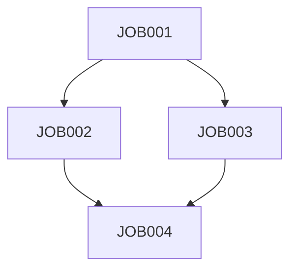

# Batch Modernization Plan: [Feature Name]

**Legacy System**: [JCL on z/OS]
**Target**: [Kubernetes Jobs / AWS Batch / Airflow]
**Date**: [YYYY-MM-DD]

## 1. Batch Job Inventory

| Job Name | Frequency | Runtime | Dependencies | Criticality |
|----------|-----------|---------|--------------|-------------|
| [JOB001] | [Daily 2AM] | [2 hours] | [JOB002] | [High] |

## 2. Dependency Analysis

### 2.1 Dependency Graph



### 2.2 Critical Path

[Identify longest dependency chain]

## 3. Modernization Options

### 3.1 Target Architecture

**Recommended**: [Kubernetes CronJobs with Airflow orchestration]

**Rationale**: [Why this approach]

### 3.2 Job Classification

| Job Type | Count | Modern Alternative |
|----------|-------|-------------------|
| Short (<5 min) | [10] | [Lambda/Functions] |
| Medium (5-60 min) | [20] | [Kubernetes Jobs] |
| Long (>1 hour) | [5] | [AWS Batch] |

## 4. Orchestration Strategy

### 4.1 Orchestration Platform

**Selected**: [Apache Airflow]

**DAG Example**:
```python
from airflow import DAG
from airflow.operators.bash import BashOperator

dag = DAG('job001', schedule='0 2 * * *')
task1 = BashOperator(task_id='extract', bash_command='python extract.py')
```

## 5. Monitoring & Alerting

### 5.1 Metrics

- Job duration
- Success rate
- Resource utilization

### 5.2 Alerting Rules

| Condition | Alert | Action |
|-----------|-------|--------|
| [Job fails] | [PagerDuty] | [Investigate] |
