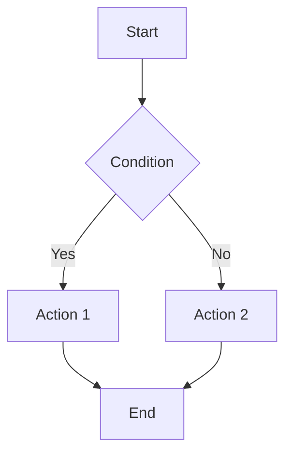

# Business Logic Extraction: [Feature Name]

**Extracted From**: [Legacy System]
**Date**: [YYYY-MM-DD]

## Overview

[Brief description of extracted business logic scope]

## 1. Business Rules Catalog

| Rule ID | Description | Source Location | Criticality | Dependencies |
|---------|-------------|-----------------|-------------|--------------|
| BR-001 | [Rule description] | [Program:Line] | [Must-have/Should-have] | [BR-002] |

## 2. Data Validations

### 2.1 Field-Level Validations

| Field | Validation Rule | Error Message | Source |
|-------|-----------------|---------------|--------|
| [Field Name] | [Required, Format, Range] | [Message] | [Program:Line] |

### 2.2 Cross-Field Validations

| Fields | Validation Logic | Source |
|--------|------------------|--------|
| [Field1, Field2] | [Conditional logic] | [Program:Line] |

## 3. Calculations & Formulas

### 3.1 Financial Calculations

| Calculation | Formula | Precision | Source |
|-------------|---------|-----------|--------|
| [Interest] | `PRINCIPAL × RATE / 100` | [6 decimals] | [Program:Line] |

### 3.2 Derived Fields

| Field | Derivation Logic | Source |
|-------|------------------|--------|
| [Total] | [SUM(LineItems)] | [Program:Line] |

## 4. Business Workflows

### 4.1 Process Flows

[Document each major workflow]

### 4.2 State Transitions

| From State | Event | To State | Business Rule |
|------------|-------|----------|---------------|
| [Pending] | [Approve] | [Approved] | [BR-005] |

## 5. Exception Handling

### 5.1 Error Conditions

| Error Code | Condition | Handling | Source |
|------------|-----------|----------|--------|
| [E001] | [Invalid amount] | [Reject transaction] | [Program:Line] |

### 5.2 Compensating Transactions

[Document rollback and compensation logic]

## 6. Regulatory Requirements

### 6.1 Compliance Rules

| Requirement | Regulation | Implementation | Source |
|-------------|------------|----------------|--------|
| [Audit trail] | [SOX] | [Log all changes] | [Program:Line] |

### 6.2 Audit Requirements

[Document audit and compliance requirements]

## Appendices

### Appendix A: Source Code References
[List all source files analyzed]

### Appendix B: Glossary
[Business terminology]
