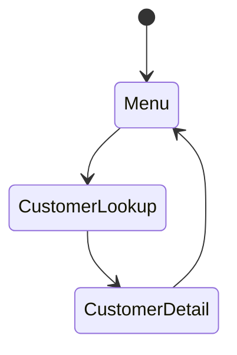

# Screen Migration Specification: [Feature Name]

**Legacy**: [3270/5250 Green Screens]
**Target**: [React Web App]
**Date**: [YYYY-MM-DD]

## 1. Legacy Screen Inventory

| Screen ID | Name | Function | Usage Frequency |
|-----------|------|----------|-----------------|
| [SCR001] | [Customer Lookup] | [Search customers] | [High] |

## 2. Screen Analysis

### 2.1 Screen Details

**Screen ID**: [SCR001]
**Fields**: [20 input, 10 display-only]
**Function Keys**: [F3=Exit, F5=Refresh, F12=Cancel]

### 2.2 Navigation Flow

## 3. Modern UI Design

### 3.1 Wireframes

[Include wireframes or mockups]

### 3.2 UI Component Mapping

| Legacy Element | Modern Component | Notes |
|----------------|------------------|-------|
| [F3=Exit] | [Close Button] | [Top right] |
| [Input Field] | [Text Input] | [With validation] |

## 4. User Workflow Improvements

| Legacy Flow | Modern Flow | Benefit |
|-------------|-------------|---------|
| [Navigate 5 screens] | [Single page] | [Faster] |

## 5. API Requirements

### 5.1 Backend Services

| Service | Endpoints | Purpose |
|---------|-----------|---------|
| [CustomerService] | [GET /customers, POST /customers] | [CRUD operations] |

## 6. Accessibility Requirements

- **WCAG Level**: [AA]
- **Screen Reader**: [Compatible]
- **Keyboard Navigation**: [Full support]
