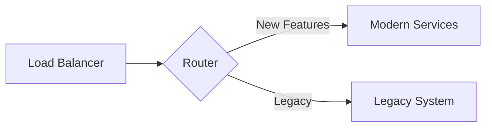

# Strangler Pattern Implementation Plan: [Feature Name]

**Legacy System**: [Monolithic COBOL/CICS]
**Target**: [Microservices]
**Date**: [YYYY-MM-DD]

## 1. Bounded Context Analysis

### 1.1 Service Boundaries

| Service | Responsibility | Data Ownership |
|---------|----------------|----------------|
| [CustomerService] | [Customer CRUD] | [customers table] |

## 2. Extraction Prioritization

### 2.1 Risk vs Value Matrix

| Service | Risk | Value | Priority | Phase |
|---------|------|-------|----------|-------|
| [NotificationService] | [Low] | [High] | [1] | [Phase 1] |

## 3. Routing Architecture

### 3.1 Proxy Design

### 3.2 Routing Rules

| Route | Condition | Target |
|-------|-----------|--------|
| [/api/v2/*] | [Always] | [Modern] |
| [/api/v1/*] | [Gradual cutover] | [Legacy → Modern] |

## 4. Phase Plans

### Phase 1: Extract Notification Service

**Duration**: [4 weeks]
**Components**: [Email, SMS notifications]
**Success Criteria**:
- [ ] Service deployed
- [ ] API functional
- [ ] 100% traffic cutover
- [ ] Legacy code removed

### Phase 2-N: [Subsequent phases]

## 5. Integration Patterns

### 5.1 Legacy-to-Modern

**Pattern**: [REST API adapter]

### 5.2 Modern-to-Legacy

**Pattern**: [Legacy API wrapper]

## 6. Monitoring Strategy

- Health checks every 30s
- Latency monitoring (P95 < 500ms)
- Error rate < 0.1%
