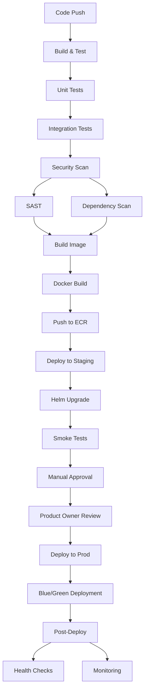
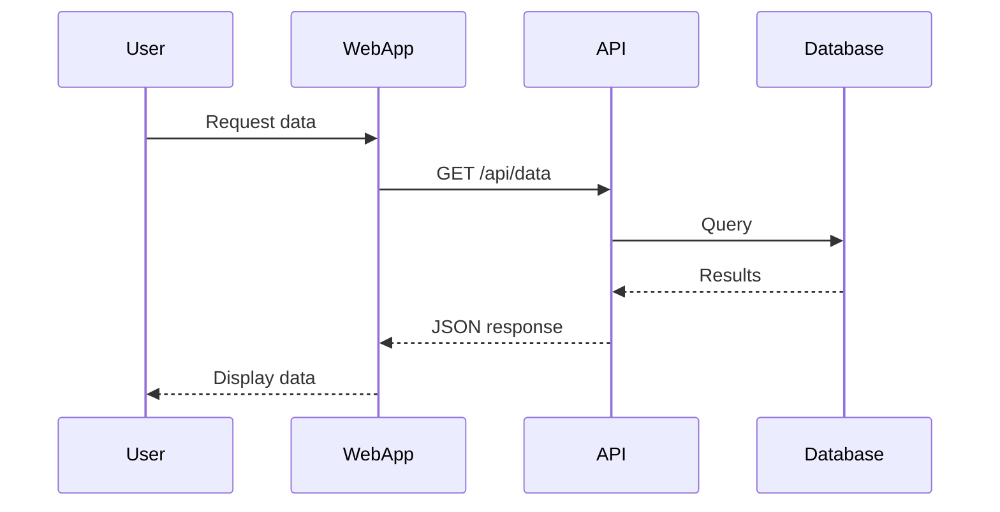
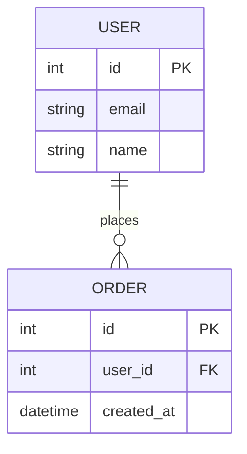

# Software Architecture Design: [PRODUCT/PROJECT NAME]

**Version**: 1.0 | **Date**: [DATE] | **Status**: Draft  
**Prepared by**: [ARCHITECT/TEAM] | **Reviewed by**: [STAKEHOLDER]

**Note**: This template is used to create the architecture design document for the entire product/system. This document should be created after completing one or more feature specifications (`/rainbow.specify`) and ground rules review (`/rainbow.regulate`), but before creating implementation plans (`/rainbow.design`) for individual features.

---

## Document Control

| Version | Date | Author | Changes |
|---------|------|--------|---------|
| 1.0 | [DATE] | [NAME] | Initial architecture design |
| | | | |

**Related Documents**:

- Ground Rules: `memory/ground-rules.md`
- Feature Specifications: `specs/[###-feature]/spec.md`
- Implementation Plans: `specs/[###-feature]/design.md` (created after this document)

---

## Executive Summary

<!--
  ACTION REQUIRED: Provide a concise overview (2-3 paragraphs) of the system
  architecture. This should be understandable by non-technical stakeholders.
-->

**Purpose**: [Brief description of what the system does and why it exists]

**Scope**: [What is included/excluded from this architecture]

**Key Architectural Decisions**:

- [Decision 1: e.g., "Microservices architecture chosen for scalability"]
- [Decision 2: e.g., "Event-driven communication for loose coupling"]
- [Decision 3: e.g., "Cloud-native deployment on AWS/Azure/GCP"]

**Target Audience**: Software architects, developers, DevOps engineers, technical project managers, and stakeholders involved in system planning and implementation.

---

## Table of Contents

1. [Introduction](#1-introduction)
2. [Architectural Drivers](#2-architectural-drivers)
3. [System Context View](#3-system-context-view)
4. [Container View](#4-container-view)
5. [Component View](#5-component-view)
6. [Code View](#6-code-view)
7. [Deployment View](#7-deployment-view)
8. [Architecture Decisions](#8-architecture-decisions)
9. [Quality Attributes](#9-quality-attributes)
10. [Risks & Technical Debt](#10-risks--technical-debt)
11. [Appendices](#11-appendices)

---

## 1. Introduction

### 1.1 Purpose

<!--
  Describe the purpose of this architecture document and what it aims to achieve.
-->

This document describes the software architecture for [PRODUCT/PROJECT NAME]. It provides a comprehensive view of the system's structure, components, and design decisions to guide development teams and stakeholders.

### 1.2 Scope

<!--
  Define what is covered by this architecture and what is explicitly out of scope.
-->

**In Scope**:

- [System boundary 1: e.g., "Web application and API backend"]
- [System boundary 2: e.g., "Data persistence and caching layers"]
- [System boundary 3: e.g., "Integration with third-party services"]

**Out of Scope**:

- [Exclusion 1: e.g., "Legacy system migration details"]
- [Exclusion 2: e.g., "Third-party service internal architectures"]
- [Exclusion 3: e.g., "Network infrastructure below application layer"]

### 1.3 Architectural Approach

<!--
  Describe the overall architectural style/pattern being used.
-->

This architecture follows [ARCHITECTURAL STYLE: e.g., "a layered, microservices-based approach" or "a modular monolith pattern" or "an event-driven architecture"].

**Key Principles**:

1. [Principle 1: e.g., "Separation of concerns"]
2. [Principle 2: e.g., "Loose coupling, high cohesion"]
3. [Principle 3: e.g., "Design for failure and resilience"]
4. [Principle 4: e.g., "Security by design"]
5. [Principle 5: e.g., "Optimize for change"]

### 1.4 Definitions, Acronyms, and Abbreviations

| Term | Definition |
|------|------------|
| API | Application Programming Interface |
| SLA | Service Level Agreement |
| RBAC | Role-Based Access Control |
| [ADD MORE] | [Specific to your system] |

---

## 2. Architectural Drivers

### 2.1 Stakeholders and Concerns

<!--
  Identify key stakeholders and their primary concerns that influence the architecture.
-->

| Stakeholder | Role | Key Concerns |
|-------------|------|--------------|
| [End Users] | System users | Performance, usability, reliability |
| [Product Owner] | Business representative | Time to market, cost, feature completeness |
| [Development Team] | Implementation | Maintainability, testability, clear interfaces |
| [Operations Team] | Deployment & monitoring | Deployability, observability, scalability |
| [Security Team] | Security compliance | Data protection, authentication, authorization |
| [Legal/Compliance] | Regulatory compliance | Data privacy (GDPR, CCPA), audit trails |

### 2.2 Business Goals

<!--
  List the key business objectives that drive architectural decisions.
-->

1. **BG-001**: [Business goal 1, e.g., "Reduce customer onboarding time from 10 minutes to 2 minutes"]
2. **BG-002**: [Business goal 2, e.g., "Support 100k concurrent users by Q4"]
3. **BG-003**: [Business goal 3, e.g., "Enable multi-region deployment for compliance"]
4. **BG-004**: [Business goal 4, e.g., "Reduce operational costs by 30% through automation"]

### 2.3 Quality Attribute Requirements

<!--
  Define the quality attributes (non-functional requirements) that shape the architecture.
  Use measurable criteria where possible.
-->

#### 2.3.1 Performance

- **PE-001**: System MUST respond to 95% of user requests within [X]ms under normal load
- **PE-002**: System MUST support [X] transactions per second (TPS)
- **PE-003**: Database queries MUST complete within [X]ms for 99th percentile

#### 2.3.2 Scalability

- **SC-001**: System MUST scale horizontally to support [X] concurrent users
- **SC-002**: System MUST handle [X]% increase in load without architecture changes
- **SC-003**: Storage MUST scale to [X]TB of data

#### 2.3.3 Availability & Reliability

- **AV-001**: System MUST maintain [X]% uptime (e.g., 99.9% = ~8.76 hours downtime/year)
- **AV-002**: System MUST recover from failures within [X] minutes (RTO)
- **AV-003**: System MUST tolerate single point of failure in [critical components]

#### 2.3.4 Security

- **SE-001**: System MUST authenticate users using [method: e.g., OAuth 2.0, SAML]
- **SE-002**: System MUST encrypt data in transit (TLS 1.3+) and at rest (AES-256)
- **SE-003**: System MUST implement RBAC with [roles: admin, user, guest]
- **SE-004**: System MUST comply with [standards: OWASP Top 10, SOC 2, ISO 27001]

#### 2.3.5 Maintainability

- **MA-001**: Code coverage MUST exceed [X]% for critical components
- **MA-002**: System MUST support zero-downtime deployments
- **MA-003**: New features MUST be developable within [timeframe] by [team size]

#### 2.3.6 Usability

- **US-001**: User interface MUST support [accessibility standards: WCAG 2.1 AA]
- **US-002**: System MUST support [languages/locales]
- **US-003**: Mobile responsive design MUST support [screen sizes]

#### 2.3.7 Observability

- **OB-001**: System MUST provide centralized logging with [retention period]
- **OB-002**: System MUST expose metrics for monitoring (latency, throughput, errors)
- **OB-003**: System MUST support distributed tracing for troubleshooting

### 2.4 Constraints

<!--
  Document technical, organizational, and business constraints that limit design choices.
-->

**Technical Constraints**:

- **TC-001**: [e.g., "Must use existing PostgreSQL database infrastructure"]
- **TC-002**: [e.g., "Must integrate with legacy SOAP-based authentication system"]
- **TC-003**: [e.g., "Must run on Kubernetes 1.25+"]

**Organizational Constraints**:

- **OC-001**: [e.g., "Development team limited to 5 engineers"]
- **OC-002**: [e.g., "Must use company-approved AWS services only"]
- **OC-003**: [e.g., "Must follow internal security review process"]

**Business Constraints**:

- **BC-001**: [e.g., "Budget limited to $X for infrastructure"]
- **BC-002**: [e.g., "Must launch MVP within 6 months"]
- **BC-003**: [e.g., "Cannot require users to install native apps"]

### 2.5 Assumptions and Dependencies

**Assumptions**:

- **AS-001**: [e.g., "Users have broadband internet connectivity (5+ Mbps)"]
- **AS-002**: [e.g., "Third-party payment API has 99.9% availability"]
- **AS-003**: [e.g., "Database can handle projected growth for 2 years"]

**Dependencies**:

- **DE-001**: [e.g., "Depends on Stripe API for payment processing"]
- **DE-002**: [e.g., "Depends on SendGrid for email delivery"]
- **DE-003**: [e.g., "Depends on Auth0 for identity management"]

---

## 3. System Context View

<!--
  C4 Model Level 1: System Context Diagram
  Shows the system as a box in the center, surrounded by users and other systems.
  This is the "zoom out" view - the big picture.
-->

### 3.1 Context Diagram

```text
┌─────────────────────────────────────────────────────────────────┐
│                        System Context                            │
│                                                                  │
│  ┌──────────┐                                                   │
│  │  End      │──────────────┐                                   │
│  │  Users    │              │                                   │
│  └──────────┘              │                                   │
│                             │                                   │
│  ┌──────────┐              │     ┌─────────────────────┐      │
│  │ Admin     │──────────────┼────▶│                     │      │
│  │ Users     │              │     │   [SYSTEM NAME]     │      │
│  └──────────┘              │     │                     │      │
│                             └────▶│  [Brief description]│      │
│  ┌──────────┐                    │                     │      │
│  │ External  │                    └──────────┬──────────┘      │
│  │ System 1  │◀──────────────────────────────┘                 │
│  └──────────┘                                                   │
│                                                                  │
│  ┌──────────┐              ┌─────────────────┐                │
│  │ External  │◀─────────────│   [SYSTEM NAME] │                │
│  │ System 2  │              └─────────────────┘                │
│  └──────────┘                                                   │
│                                                                  │
└─────────────────────────────────────────────────────────────────┘
```

<!--
  ACTION REQUIRED: Replace the diagram above with an actual diagram.
  RECOMMENDED: Use Mermaid diagram for version control and maintainability:
  
  ```mermaid
  graph TB
      Users[End Users] --> System[SYSTEM NAME]
      Admins[Admin Users] --> System
      System --> ExtSystem1[External System 1]
      System --> ExtSystem2[External System 2]

  ```
  
  Alternatives: ASCII art (shown above), C4-PlantUML, or Draw.io/Lucidchart (link to image)
-->

### 3.2 Context Description

**System**: [SYSTEM NAME]  
[1-2 paragraph description of what the system does from a high level]

**Users and External Systems**:

| Actor/System | Type | Description | Interaction |
|--------------|------|-------------|-------------|
| [End Users] | User | [Who they are] | [How they use the system] |
| [Admin Users] | User | [Who they are] | [How they use the system] |
| [External System 1] | External System | [What it is] | [What data/services exchanged] |
| [External System 2] | External System | [What it is] | [What data/services exchanged] |

### 3.3 System Responsibilities

**What the system does**:
- [Responsibility 1: e.g., "Manages user authentication and authorization"]
- [Responsibility 2: e.g., "Processes and stores customer orders"]
- [Responsibility 3: e.g., "Generates reports and analytics"]

**What the system does NOT do** (delegated to external systems):
- [External responsibility 1: e.g., "Payment processing (handled by Stripe)"]
- [External responsibility 2: e.g., "Email delivery (handled by SendGrid)"]
- [External responsibility 3: e.g., "File storage (handled by AWS S3)"]

---

## 4. Container View

<!--
  C4 Model Level 2: Container Diagram
  Shows the high-level technical building blocks (containers) of the system.
  Containers = applications, data stores, microservices, etc.
-->

### 4.1 Container Diagram

```text
┌──────────────────────────────────────────────────────────────────┐
│                         Container View                            │
│                                                                   │
│  ┌──────────┐                                                    │
│  │  Users   │                                                    │
│  └────┬─────┘                                                    │
│       │                                                          │
│       │ HTTPS                                                    │
│       ▼                                                          │
│  ┌─────────────────────┐                                        │
│  │  Web Application    │                                        │
│  │  [React/Vue/Angular]│                                        │
│  │  Port: 443          │                                        │
│  └──────────┬──────────┘                                        │
│             │                                                    │
│             │ REST/GraphQL                                       │
│             ▼                                                    │
│  ┌─────────────────────┐         ┌──────────────────┐          │
│  │  API Application    │────────▶│  Database        │          │
│  │  [FastAPI/Express]  │         │  [PostgreSQL]    │          │
│  │  Port: 8000         │         │  Port: 5432      │          │
│  └──────────┬──────────┘         └──────────────────┘          │
│             │                                                    │
│             │                    ┌──────────────────┐          │
│             └───────────────────▶│  Cache           │          │
│                                   │  [Redis]         │          │
│                                   │  Port: 6379      │          │
│                                   └──────────────────┘          │
│                                                                   │
└──────────────────────────────────────────────────────────────────┘
```

<!--
  ACTION REQUIRED: Replace the diagram above with your actual container architecture.
  RECOMMENDED: Use Mermaid diagram for clarity and version control:
  
  ```mermaid
  graph TB
      Users[Users] -->|HTTPS| WebApp[Web Application<br/>React/Vue/Angular<br/>Port: 443]
      WebApp -->|REST/GraphQL| API[API Application<br/>FastAPI/Express<br/>Port: 8000]
      API -->|SQL| DB[(Database<br/>PostgreSQL<br/>Port: 5432)]
      API -->|Redis Protocol| Cache[(Cache<br/>Redis<br/>Port: 6379)]

  ```
  
  Include all applications, databases, message queues, caches, etc.
-->

### 4.2 Container Descriptions

#### Container 1: [Web Application]

- **Technology**: [e.g., React 18, TypeScript, Vite]
- **Purpose**: [e.g., "Provides the user interface for end users"]
- **Responsibilities**:
  - [Responsibility 1: e.g., "Renders UI components"]
  - [Responsibility 2: e.g., "Handles client-side routing"]
  - [Responsibility 3: e.g., "Manages user session state"]
- **Communication**:
  - Calls [API Application] via [HTTPS REST API]
  - Authenticates with [Auth Service] via [OAuth 2.0]

#### Container 2: [API Application]

- **Technology**: [e.g., FastAPI 0.104, Python 3.11, Uvicorn]
- **Purpose**: [e.g., "Provides REST API for business logic"]
- **Responsibilities**:
  - [Responsibility 1: e.g., "Handles business logic and validation"]
  - [Responsibility 2: e.g., "Orchestrates data access"]
  - [Responsibility 3: e.g., "Enforces authorization rules"]
- **Communication**:
  - Reads/writes to [Database] via [PostgreSQL driver]
  - Publishes events to [Message Queue] via [RabbitMQ client]
  - Caches data in [Redis] via [Redis client]

#### Container 3: [Database]

- **Technology**: [e.g., PostgreSQL 15]
- **Purpose**: [e.g., "Stores persistent application data"]
- **Responsibilities**:
  - [Responsibility 1: e.g., "Stores user accounts and profiles"]
  - [Responsibility 2: e.g., "Stores transactional data"]
  - [Responsibility 3: e.g., "Maintains referential integrity"]
- **Schema Overview**: [Link to schema diagram or list key tables]
  - Tables: [users, orders, products, etc.]

#### Container 4: [Cache]

- **Technology**: [e.g., Redis 7]
- **Purpose**: [e.g., "Provides fast access to frequently accessed data"]
- **Responsibilities**:
  - [Responsibility 1: e.g., "Caches user sessions"]
  - [Responsibility 2: e.g., "Caches API responses for 5 minutes"]
  - [Responsibility 3: e.g., "Implements rate limiting counters"]

[Add more containers as needed]

### 4.3 Inter-Container Communication

| From Container | To Container | Protocol | Purpose | Data Format |
|----------------|--------------|----------|---------|-------------|
| [Web App] | [API App] | HTTPS | API calls | JSON |
| [API App] | [Database] | TCP | Data persistence | SQL |
| [API App] | [Cache] | TCP | Caching | Redis protocol |
| [API App] | [Message Queue] | AMQP | Event publishing | JSON |

---

## 5. Component View

<!--
  C4 Model Level 3: Component Diagram
  Shows the internal structure of a container - the main components/modules.
  Create one component diagram for each critical container.
-->

### 5.1 [Container Name] Component Diagram

```text
┌─────────────────────────────────────────────────────────────────┐
│              [Container Name] - Component View                   │
│                                                                  │
│  ┌────────────────────────────────────────────────────────┐    │
│  │  Presentation Layer                                     │    │
│  │  ┌──────────────┐  ┌──────────────┐  ┌──────────────┐ │    │
│  │  │  Controller  │  │  Controller  │  │  Controller  │ │    │
│  │  │      1       │  │      2       │  │      3       │ │    │
│  │  └──────┬───────┘  └──────┬───────┘  └──────┬───────┘ │    │
│  └─────────┼──────────────────┼──────────────────┼─────────┘    │
│            │                  │                  │               │
│  ┌─────────┼──────────────────┼──────────────────┼─────────┐    │
│  │         ▼                  ▼                  ▼         │    │
│  │  Business Logic Layer                                   │    │
│  │  ┌──────────────┐  ┌──────────────┐  ┌──────────────┐ │    │
│  │  │   Service    │  │   Service    │  │   Service    │ │    │
│  │  │      1       │  │      2       │  │      3       │ │    │
│  │  └──────┬───────┘  └──────┬───────┘  └──────┬───────┘ │    │
│  └─────────┼──────────────────┼──────────────────┼─────────┘    │
│            │                  │                  │               │
│  ┌─────────┼──────────────────┼──────────────────┼─────────┐    │
│  │         ▼                  ▼                  ▼         │    │
│  │  Data Access Layer                                      │    │
│  │  ┌──────────────┐  ┌──────────────┐  ┌──────────────┐ │    │
│  │  │  Repository  │  │  Repository  │  │  Repository  │ │    │
│  │  │      1       │  │      2       │  │      3       │ │    │
│  │  └──────────────┘  └──────────────┘  └──────────────┘ │    │
│  └─────────────────────────────────────────────────────────┘    │
│                                                                  │
└─────────────────────────────────────────────────────────────────┘
```

<!--
  ACTION REQUIRED: Replace with your actual component structure.
  RECOMMENDED: Use Mermaid diagram to show component layers and dependencies:
  
  ```mermaid
  graph TB
      subgraph "Presentation Layer"
          C1[Controller 1]
          C2[Controller 2]
          C3[Controller 3]
      end
      subgraph "Business Logic Layer"
          S1[Service 1]
          S2[Service 2]
          S3[Service 3]
      end
      subgraph "Data Access Layer"
          R1[Repository 1]
          R2[Repository 2]
          R3[Repository 3]
      end
      C1 --> S1
      C2 --> S2
      C3 --> S3
      S1 --> R1
      S2 --> R2
      S3 --> R3

  ```
  
  Show the major components and their relationships.
-->

### 5.2 Component Descriptions

#### Component Group: [Presentation Layer / Controllers]

##### Component: [UserController]

- **Purpose**: [e.g., "Handles HTTP requests related to user management"]
- **Responsibilities**:
  - [Responsibility 1: e.g., "Validates incoming request data"]
  - [Responsibility 2: e.g., "Maps HTTP requests to service calls"]
  - [Responsibility 3: e.g., "Returns HTTP responses with proper status codes"]
- **Dependencies**: [UserService, AuthService]
- **Exposed Interfaces**:
  - `POST /api/users` - Create user
  - `GET /api/users/{id}` - Get user by ID
  - `PUT /api/users/{id}` - Update user
  - `DELETE /api/users/{id}` - Delete user

[Add more components as needed]

#### Component Group: [Business Logic Layer / Services]

##### Component: [UserService]

- **Purpose**: [e.g., "Encapsulates business logic for user operations"]
- **Responsibilities**:
  - [Responsibility 1: e.g., "Enforces business rules for user creation"]
  - [Responsibility 2: e.g., "Validates email uniqueness"]
  - [Responsibility 3: e.g., "Publishes user events to message queue"]
- **Dependencies**: [UserRepository, EmailService, EventBus]
- **Key Operations**:
  - `createUser(userData): User`
  - `getUserById(userId): User`
  - `updateUser(userId, userData): User`
  - `deleteUser(userId): void`

[Add more components as needed]

#### Component Group: [Data Access Layer / Repositories]

##### Component: [UserRepository]

- **Purpose**: [e.g., "Provides data access abstraction for user data"]
- **Responsibilities**:
  - [Responsibility 1: e.g., "Executes SQL queries for user data"]
  - [Responsibility 2: e.g., "Maps database rows to domain objects"]
  - [Responsibility 3: e.g., "Handles database transactions"]
- **Dependencies**: [Database Connection Pool]
- **Key Operations**:
  - `save(user): void`
  - `findById(userId): User | null`
  - `findByEmail(email): User | null`
  - `delete(userId): void`

[Add more components as needed]

### 5.3 Component Interaction Patterns

**Pattern 1: [Request-Response]**
- [Description: e.g., "Synchronous HTTP request/response for API calls"]
- [When used: e.g., "User-initiated actions requiring immediate response"]

**Pattern 2: [Event-Driven]**
- [Description: e.g., "Asynchronous event publishing for decoupled operations"]
- [When used: e.g., "Background processing, notifications, audit logging"]

**Pattern 3: [Repository Pattern]**
- [Description: e.g., "Abstraction over data access logic"]
- [When used: e.g., "All database operations"]

---

## 6. Code View

<!--
  C4 Model Level 4: Code Diagram (optional, usually in IDE)
  Shows the internal structure of a component at the class/function level.
  This section is usually omitted from architecture docs as it's visible in code.
  Include only for critical/complex components that need explanation.
-->

### 6.1 Code Organization

**Directory Structure**:

```text
project-root/
├── src/
│   ├── api/                    # API/presentation layer
│   │   ├── controllers/        # HTTP request handlers
│   │   ├── middleware/         # Request/response middleware
│   │   └── routes/             # Route definitions
│   ├── business/               # Business logic layer
│   │   ├── services/           # Business services
│   │   ├── models/             # Domain models
│   │   └── validators/         # Business rule validators
│   ├── data/                   # Data access layer
│   │   ├── repositories/       # Data access abstractions
│   │   ├── entities/           # Database entities/ORM models
│   │   └── migrations/         # Database migration scripts
│   ├── infrastructure/         # Infrastructure concerns
│   │   ├── config/             # Configuration management
│   │   ├── logging/            # Logging utilities
│   │   ├── messaging/          # Message queue clients
│   │   └── cache/              # Caching utilities
│   └── shared/                 # Shared utilities
│       ├── types/              # Shared type definitions
│       ├── utils/              # Utility functions
│       └── constants/          # Application constants
├── tests/
│   ├── unit/                   # Unit tests
│   ├── integration/            # Integration tests
│   └── e2e/                    # End-to-end tests
├── docs/                       # Documentation
└── scripts/                    # Build/deployment scripts
```

### 6.2 Naming Conventions

**Files**:

- [Convention 1: e.g., "PascalCase for classes: `UserService.ts`"]
- [Convention 2: e.g., "kebab-case for components: `user-profile.tsx`"]
- [Convention 3: e.g., "camelCase for utilities: `formatDate.ts`"]

**Code**:

- [Convention 1: e.g., "PascalCase for classes/interfaces: `class UserService`"]
- [Convention 2: e.g., "camelCase for functions/variables: `function getUserById()`"]
- [Convention 3: e.g., "UPPER_SNAKE_CASE for constants: `const MAX_RETRY_COUNT`"]

### 6.3 Key Design Patterns

| Pattern | Purpose | Usage Example |
|---------|---------|---------------|
| [Repository] | Data access abstraction | `UserRepository`, `OrderRepository` |
| [Service Layer] | Business logic encapsulation | `UserService`, `OrderService` |
| [Factory] | Object creation | `DatabaseConnectionFactory` |
| [Singleton] | Single instance | `ConfigurationManager` |
| [Strategy] | Runtime algorithm selection | `PaymentStrategy` (Credit, Debit, PayPal) |
| [Observer] | Event notification | `EventEmitter` for domain events |

---

## 7. Deployment View

<!--
  Shows how containers are deployed to infrastructure.
  Include production and key non-production environments.
-->

### 7.1 Deployment Architecture

#### 7.1.1 Production Environment

```text
┌─────────────────────────────────────────────────────────────────┐
│                    Production Deployment                          │
│                                                                   │
│  ┌───────────────────────────────────────────────────────────┐  │
│  │  Region: [us-east-1]                                       │  │
│  │                                                             │  │
│  │  ┌─────────────────────────────────────────────────────┐  │  │
│  │  │  Availability Zone 1                                 │  │  │
│  │  │  ┌───────────┐  ┌───────────┐  ┌──────────┐        │  │  │
│  │  │  │   Web     │  │    API    │  │   DB     │        │  │  │
│  │  │  │   Server  │  │   Server  │  │  Primary │        │  │  │
│  │  │  └───────────┘  └───────────┘  └──────────┘        │  │  │
│  │  └─────────────────────────────────────────────────────┘  │  │
│  │                                                             │  │
│  │  ┌─────────────────────────────────────────────────────┐  │  │
│  │  │  Availability Zone 2                                 │  │  │
│  │  │  ┌───────────┐  ┌───────────┐  ┌──────────┐        │  │  │
│  │  │  │   Web     │  │    API    │  │   DB     │        │  │  │
│  │  │  │   Server  │  │   Server  │  │  Replica │        │  │  │
│  │  │  └───────────┘  └───────────┘  └──────────┘        │  │  │
│  │  └─────────────────────────────────────────────────────┘  │  │
│  │                                                             │  │
│  │  ┌─────────────────────────────────────────────────────┐  │  │
│  │  │  Shared Services                                     │  │  │
│  │  │  ┌───────────┐  ┌───────────┐  ┌──────────┐        │  │  │
│  │  │  │   Redis   │  │  Message  │  │  S3      │        │  │  │
│  │  │  │   Cache   │  │   Queue   │  │  Storage │        │  │  │
│  │  │  └───────────┘  └───────────┘  └──────────┘        │  │  │
│  │  └─────────────────────────────────────────────────────┘  │  │
│  └───────────────────────────────────────────────────────────┘  │
│                                                                   │
└─────────────────────────────────────────────────────────────────┘
```

<!--
  ACTION REQUIRED: Replace with your actual deployment architecture.
  RECOMMENDED: Use Mermaid diagram for infrastructure visualization:
  
  ```mermaid
  graph TB
      subgraph "Production Region: us-east-1"
          subgraph "Availability Zone 1"
              Web1[Web Server]
              API1[API Server]
              DB1[(DB Primary)]
          end
          subgraph "Availability Zone 2"
              Web2[Web Server]
              API2[API Server]
              DB2[(DB Replica)]
          end
          subgraph "Shared Services"
              Redis[(Redis Cache)]
              MQ[Message Queue]
              S3[(S3 Storage)]
          end
      end
  ```
  
  Include load balancers, CDNs, multi-region setup if applicable.
-->

#### 7.1.2 Environment Specifications

| Environment | Purpose | Infrastructure | Scaling |
|-------------|---------|----------------|---------|
| **Production** | Live system | [e.g., AWS EKS, 3 nodes, t3.xlarge] | Auto-scale 3-10 pods |
| **Staging** | Pre-production testing | [e.g., AWS EKS, 2 nodes, t3.large] | Fixed 2 pods |
| **Development** | Developer testing | [e.g., Docker Compose on local] | Single instance |
| **QA** | Quality assurance | [e.g., AWS EKS, 1 node, t3.medium] | Fixed 1 pod |

### 7.2 Infrastructure Components

#### 7.2.1 Compute

| Component | Technology | Configuration | Purpose |
|-----------|------------|---------------|---------|
| [Web Server] | [e.g., Nginx on Kubernetes] | [e.g., 2 vCPU, 4GB RAM] | Serve static content, reverse proxy |
| [API Server] | [e.g., Uvicorn on Kubernetes] | [e.g., 4 vCPU, 8GB RAM] | Run API application |
| [Worker] | [e.g., Celery on Kubernetes] | [e.g., 2 vCPU, 4GB RAM] | Background job processing |

#### 7.2.2 Data Storage

| Component | Technology | Configuration | Purpose |
|-----------|------------|---------------|---------|
| [Primary DB] | [e.g., RDS PostgreSQL 15] | [e.g., db.r6g.xlarge, 500GB SSD] | Transactional data |
| [Cache] | [e.g., ElastiCache Redis 7] | [e.g., cache.r6g.large, 6GB] | Session/data caching |
| [Object Storage] | [e.g., S3 Standard] | [e.g., 1TB, lifecycle to Glacier] | File storage |
| [Search] | [e.g., OpenSearch] | [e.g., 3 data nodes, 4GB each] | Full-text search |

#### 7.2.3 Networking

| Component | Technology | Configuration | Purpose |
|-----------|------------|---------------|---------|
| [Load Balancer] | [e.g., AWS ALB] | [e.g., Multi-AZ, SSL termination] | Distribute traffic |
| [CDN] | [e.g., CloudFront] | [e.g., Global edge locations] | Static content delivery |
| [DNS] | [e.g., Route 53] | [e.g., Latency-based routing] | Domain resolution |
| [API Gateway] | [e.g., Kong/AWS API Gateway] | [e.g., Rate limiting, auth] | API management |

### 7.3 Deployment Pipeline

**CI/CD Workflow**:



**Deployment Strategy**: [e.g., "Blue/Green deployment with automatic rollback on health check failure"]

### 7.4 Infrastructure as Code

- **Tool**: [e.g., Terraform 1.5+]
- **Repository**: [e.g., `infrastructure/terraform/`]
- **State Management**: [e.g., "S3 backend with DynamoDB state locking"]
- **Key Modules**:
  - [Module 1: e.g., "VPC and networking"]
  - [Module 2: e.g., "EKS cluster"]
  - [Module 3: e.g., "RDS database"]
  - [Module 4: e.g., "IAM roles and policies"]

### 7.5 Disaster Recovery

**Backup Strategy**:

- **Database**: [e.g., "Automated daily snapshots, retained for 30 days, backed up to S3"]
- **Files**: [e.g., "S3 with versioning enabled, cross-region replication to us-west-2"]
- **Configuration**: [e.g., "Infrastructure code in Git, secrets in AWS Secrets Manager"]

**Recovery Objectives**:

- **RTO (Recovery Time Objective)**: [e.g., "4 hours for full system restoration"]
- **RPO (Recovery Point Objective)**: [e.g., "15 minutes of data loss maximum"]

**Disaster Recovery Plan**:

1. [Step 1: e.g., "Detect failure via monitoring alerts"]
2. [Step 2: e.g., "Initiate incident response process"]
3. [Step 3: e.g., "Restore database from latest snapshot"]
4. [Step 4: e.g., "Redeploy application to alternate region"]
5. [Step 5: e.g., "Update DNS to point to new region"]
6. [Step 6: e.g., "Validate system functionality"]

---

## 8. Architecture Decisions

<!--
  Document key architectural decisions using Architecture Decision Records (ADR) format.
  Each decision should explain: Context, Decision, Consequences, and Alternatives.
-->

### 8.1 Decision Log

| ID | Date | Title | Status |
|----|------|-------|--------|
| ADR-001 | [DATE] | [Decision title] | [Accepted/Superseded/Deprecated] |
| ADR-002 | [DATE] | [Decision title] | [Accepted] |
| ADR-003 | [DATE] | [Decision title] | [Proposed] |

### 8.2 Architecture Decision Records

#### ADR-001: [Decision Title]

**Date**: [DATE]  
**Status**: [Proposed | Accepted | Deprecated | Superseded by ADR-XXX]  
**Deciders**: [List of people involved]

**Context**:
[Describe the issue or situation that prompted this decision. What forces are at play?]

**Decision**:
[Describe the decision and its implications. Be specific and actionable.]

**Rationale**:
[Explain why this decision was made. What factors influenced it?]

**Consequences**:

*Positive*:

- [Benefit 1]
- [Benefit 2]
- [Benefit 3]

*Negative*:

- [Trade-off 1]
- [Trade-off 2]
- [Trade-off 3]

*Neutral*:

- [Impact 1]
- [Impact 2]

**Alternatives Considered**:

1. **Alternative 1**: [Description]
   - Pros: [List pros]
   - Cons: [List cons]
   - Why rejected: [Reason]

2. **Alternative 2**: [Description]
   - Pros: [List pros]
   - Cons: [List cons]
   - Why rejected: [Reason]

**Related Decisions**:

- [ADR-XXX]: [Related decision]

---

#### ADR-002: [Example: Use Microservices Architecture]

**Date**: 2024-01-15  
**Status**: Accepted  
**Deciders**: Architecture Team, CTO

**Context**:
The system needs to scale independently by function (user management, order processing, payments) and be developed by multiple teams concurrently. The existing monolith has become difficult to deploy and scale.

**Decision**:
Adopt a microservices architecture with independent services for user management, orders, payments, and notifications. Services communicate via REST APIs and asynchronous message queues.

**Rationale**:

- Teams can work independently with minimal coordination
- Services can scale based on individual load patterns
- Technology stack can be optimized per service
- Failures are isolated to individual services

**Consequences**:

*Positive*:

- Independent deployment and scaling per service
- Team autonomy and faster development cycles
- Technology flexibility per service
- Better fault isolation

*Negative*:

- Increased operational complexity (more services to monitor)
- Distributed system challenges (network latency, partial failures)
- Data consistency across services requires careful design
- Increased infrastructure costs

*Neutral*:

- Need for robust DevOps practices and tooling
- API versioning and backward compatibility required

**Alternatives Considered**:

1. **Modular Monolith**: Well-structured monolith with clear module boundaries
   - Pros: Simpler deployment, easier transactions, lower infrastructure cost
   - Cons: All modules share same technology stack, scaling requires scaling entire monolith
   - Why rejected: Doesn't solve team independence and scaling issues

2. **Serverless Functions**: AWS Lambda for each feature
   - Pros: Extreme scalability, pay-per-use pricing, no server management
   - Cons: Cold start latency, vendor lock-in, complex state management
   - Why rejected: Not suitable for long-running operations and complex workflows

**Related Decisions**:

- ADR-003: API Gateway for Service Communication
- ADR-005: Event-Driven Architecture for Async Communication

---

[Add more ADRs as needed for critical decisions]

---

## 9. Quality Attributes

<!--
  Detail how the architecture achieves the quality attribute requirements
  defined in Section 2.3. Provide specific implementation strategies.
-->

### 9.1 Performance Strategies

**Strategy 1: Caching**

- **Implementation**: Redis cache for frequently accessed data (user sessions, product catalogs)
- **Cache Invalidation**: Time-based expiration (5 minutes) + event-based invalidation
- **Expected Impact**: Reduce database load by 70%, API response time from 200ms to 50ms

**Strategy 2: Database Optimization**

- **Implementation**: Read replicas for analytics queries, connection pooling (100 connections)
- **Indexes**: On `user_id`, `email`, `order_date`, `product_id`
- **Expected Impact**: Query performance <50ms for 99th percentile

**Strategy 3: Asynchronous Processing**

- **Implementation**: Message queue (RabbitMQ) for email notifications, report generation
- **Expected Impact**: Immediate API responses, background processing up to 10k messages/sec

### 9.2 Scalability Strategies

**Strategy 1: Horizontal Scaling**

- **Implementation**: Stateless API servers with Kubernetes auto-scaling (3-10 pods)
- **Trigger**: CPU >70% or requests >1000/sec
- **Expected Impact**: Support 100k concurrent users

**Strategy 2: Database Sharding**

- **Implementation**: Shard user data by user_id (hash-based sharding) across 4 shards
- **Expected Impact**: Linear scaling of database write capacity

**Strategy 3: Content Delivery Network**

- **Implementation**: CloudFront CDN for static assets (images, CSS, JS)
- **Expected Impact**: Reduce origin load by 90%, improve global latency

### 9.3 Availability & Reliability Strategies

**Strategy 1: Redundancy**

- **Implementation**: Multi-AZ deployment, 3 API replicas, database with read replicas
- **Expected Impact**: 99.9% availability (8.76 hours downtime/year max)

**Strategy 2: Health Checks & Auto-Recovery**

- **Implementation**: Kubernetes liveness/readiness probes, automatic pod restart
- **Interval**: Health check every 10 seconds
- **Expected Impact**: Failed containers restarted within 30 seconds

**Strategy 3: Circuit Breakers**

- **Implementation**: Resilience4j circuit breaker for external API calls
- **Threshold**: Open after 50% failure rate over 10 requests
- **Expected Impact**: Prevent cascading failures, graceful degradation

### 9.4 Security Strategies

**Strategy 1: Authentication & Authorization**

- **Implementation**: OAuth 2.0 with JWT tokens, RBAC with roles (admin, user, guest)
- **Token Expiry**: Access token 15 minutes, refresh token 7 days
- **Expected Impact**: Secure user authentication, fine-grained access control

**Strategy 2: Encryption**

- **Implementation**: TLS 1.3 for data in transit, AES-256 for data at rest
- **Certificate Management**: AWS Certificate Manager, auto-renewal
- **Expected Impact**: Protection against eavesdropping and data breaches

**Strategy 3: Input Validation & Output Encoding**

- **Implementation**: Pydantic models for input validation, parameterized queries
- **Expected Impact**: Protection against SQL injection, XSS attacks

**Strategy 4: Security Scanning**

- **Implementation**: SAST (SonarQube), DAST (OWASP ZAP), dependency scanning (Snyk)
- **Frequency**: On every commit (SAST), weekly (DAST)
- **Expected Impact**: Early detection of security vulnerabilities

### 9.5 Maintainability Strategies

**Strategy 1: Automated Testing**

- **Implementation**: Unit tests (pytest), integration tests, E2E tests (Playwright)
- **Coverage Target**: >80% for critical paths
- **Expected Impact**: Catch regressions early, enable confident refactoring

**Strategy 2: Observability**

- **Implementation**: Structured logging (JSON), metrics (Prometheus), tracing (Jaeger)
- **Log Retention**: 30 days in Elasticsearch
- **Expected Impact**: Faster troubleshooting, proactive issue detection

**Strategy 3: Documentation**

- **Implementation**: OpenAPI specs for APIs, ADRs for decisions, inline code comments
- **Automation**: Auto-generate API docs from code annotations
- **Expected Impact**: Reduce onboarding time, improve knowledge sharing

---

## 10. Risks & Technical Debt

### 10.1 Architecture Risks

| Risk ID | Description | Impact | Probability | Mitigation Strategy |
|---------|-------------|--------|-------------|---------------------|
| AR-001 | [Risk: e.g., "Database becomes bottleneck under high load"] | High | Medium | [Strategy: e.g., "Implement read replicas and caching"] |
| AR-002 | [Risk: e.g., "Third-party API downtime affects core features"] | High | Low | [Strategy: e.g., "Circuit breakers + fallback mechanisms"] |
| AR-003 | [Risk: e.g., "Vendor lock-in with AWS services"] | Medium | High | [Strategy: e.g., "Use abstraction layers, avoid proprietary APIs"] |
| AR-004 | [Risk: e.g., "Security breach due to misconfigured access"] | Critical | Low | [Strategy: e.g., "Automated security audits, principle of least privilege"] |

### 10.2 Known Technical Debt

| Debt ID | Description | Impact | Effort | Priority | Plan |
|---------|-------------|--------|--------|----------|------|
| TD-001 | [Debt: e.g., "Legacy authentication module not using modern standards"] | Medium | High | P2 | [Plan: e.g., "Refactor to OAuth 2.0 in Q3"] |
| TD-002 | [Debt: e.g., "No automated backup testing"] | High | Medium | P1 | [Plan: e.g., "Implement quarterly DR drills"] |
| TD-003 | [Debt: e.g., "Insufficient monitoring coverage for background jobs"] | Low | Low | P3 | [Plan: e.g., "Add metrics in next sprint"] |

### 10.3 Open Questions & Future Considerations

**Open Questions**:

1. [Question 1: e.g., "How to handle eventual consistency in distributed transactions?"]
   - Status: Under investigation
   - Decision deadline: [DATE]

2. [Question 2: e.g., "Should we adopt GraphQL for more flexible client queries?"]
   - Status: Pending team discussion
   - Decision deadline: [DATE]

**Future Enhancements**:

- [Enhancement 1: e.g., "Multi-region active-active deployment for global users"]
  - Timeframe: Year 2
  - Depends on: Business expansion to Asia/Europe

- [Enhancement 2: e.g., "Machine learning-based recommendation engine"]
  - Timeframe: Year 2
  - Depends on: Sufficient user data (1M+ users)

- [Enhancement 3: e.g., "Mobile native apps for iOS and Android"]
  - Timeframe: Q4 2024
  - Depends on: Budget approval

---

## 11. Appendices

### 11.1 Glossary

| Term | Definition |
|------|------------|
| [Term 1] | [Definition] |
| [Term 2] | [Definition] |
| [Term 3] | [Definition] |

### 11.2 References

1. **Standards**:
   - IEEE 42010:2011 - Systems and software engineering — Architecture description
   - ISO/IEC 25010:2011 - Systems and software Quality Requirements and Evaluation (SQuaRE)

2. **Methodologies**:
   - C4 Model for visualizing software architecture: <https://c4model.com/>
   - Arc42 architecture template: <https://arc42.org/>
   - Architecture Decision Records (ADR): <https://adr.github.io/>

3. **Project References**:
   - [Reference 1: e.g., "Company Security Standards v2.0"]
   - [Reference 2: e.g., "API Design Guidelines"]
   - [Reference 3: e.g., "Infrastructure Best Practices"]

### 11.3 Related Documents

- **Ground Rules**: `memory/ground-rules.md` - Project constraints and principles
- **Feature Specifications**: `specs/*/spec.md` - Individual feature requirements
- **Implementation Plans**: `specs/*/design.md` - Feature implementation strategies
- **API Documentation**: [Link to OpenAPI/Swagger docs]
- **Runbooks**: [Link to operational procedures]

### 11.4 Diagrams & Models

<!--
  List of all architecture diagrams and models with links/references.
  RECOMMENDED: Use Mermaid diagrams embedded in this document for maintainability.
-->

- **System Context Diagram**: [Section 3.1 or external tool link]
- **Container Diagram**: [Section 4.1 or external tool link]
- **Component Diagrams**: [Section 5.x or external tool link]
- **Deployment Diagram**: [Section 7.1 or external tool link]
- **Entity-Relationship Diagram**: [Link to database schema documentation or Mermaid ER diagram]
- **Sequence Diagrams**: [Link to detailed interaction flows or Mermaid sequence diagrams]

**Mermaid Diagram Examples**:

For sequence diagrams showing interactions between components:



For entity-relationship diagrams:



### 11.5 Approval & Review

| Role | Name | Signature | Date |
|------|------|-----------|------|
| System Architect | [NAME] | | |
| Lead Developer | [NAME] | | |
| DevOps Lead | [NAME] | | |
| Product Owner | [NAME] | | |
| CTO/Technical Director | [NAME] | | |

### 11.6 Change History

| Version | Date | Author | Summary of Changes |
|---------|------|--------|--------------------|
| 0.1 | [DATE] | [NAME] | Initial draft |
| 0.2 | [DATE] | [NAME] | Added deployment view |
| 1.0 | [DATE] | [NAME] | Final version for approval |

---

**END OF ARCHITECTURE DESIGN DOCUMENT**

---

## Notes for Template Users

### When to Use This Template

- **After** completing one or more feature specifications using `/rainbow.specify`
- **After** reviewing project constraints using `/rainbow.regulate`
- **Before** creating implementation plans using `/rainbow.design`
- When you need to design the **overall system architecture**, not just a single feature

### How to Fill Out This Template

1. **Start with Section 2 (Architectural Drivers)**: Understand stakeholders, business goals, and quality requirements
2. **Work through C4 levels (Sections 3-6)**: Start high-level (context) and drill down (containers, components)
3. **Document deployment (Section 7)**: Define how the system runs in production
4. **Capture decisions (Section 8)**: Use ADRs for all significant architectural choices
5. **Map quality strategies (Section 9)**: Show how architecture achieves quality requirements
6. **Identify risks (Section 10)**: Be honest about limitations and technical debt

### Relationship to Other Documents

- **Ground Rules** (`memory/ground-rules.md`): Defines project-wide constraints that this architecture must respect
- **Feature Specs** (`specs/*/spec.md`): Define individual features; this architecture shows how they fit together
- **Implementation Plans** (`specs/*/design.md`): Tactical plans for building features; guided by this architecture
- **Tasks** (`specs/*/tasks.md`): Individual work items; derived from plans that follow this architecture

### Tips for Success

- **Keep it visual**: Use diagrams extensively (C4, sequence diagrams, deployment diagrams) - **prefer Mermaid** for version control and easy updates
- **Be specific**: Avoid generic statements; use actual technologies, numbers, and examples
- **Document decisions**: Every significant choice should have an ADR explaining the rationale
- **Think about stakeholders**: Different sections serve different audiences (exec summary for business, deployment for ops)
- **Keep it updated**: Architecture evolves; treat this as a living document
- **Link to code**: Reference actual implementations to keep architecture grounded in reality
- **Use Mermaid diagrams**: Embed diagrams directly in markdown using Mermaid syntax for better maintainability, version control, and collaboration
