# 🏗️ Brownfield Project Workflow

**Add features systematically to existing applications using Spec-Driven Development**

This guide shows you how to add new features to an existing codebase while maintaining quality and consistency.

---

## 📋 Overview

**Brownfield projects** are existing applications that need new features or enhancements. Hanoi Rainbow helps you:
- Add features systematically without breaking existing functionality
- Maintain consistency with existing architecture
- Ensure quality through structured validation
- Keep documentation up-to-date

**Timeline**: Typically 1-2 weeks per feature, depending on complexity.

### Brownfield Feature Addition Flow

```mermaid
graph TD
    A[Existing Application] --> B[Initialize Rainbow<br/>if needed]
    B --> C[/rainbow.specify<br/>New Feature]
    C --> D[/rainbow.design<br/>Plan Integration]
    D --> E[/rainbow.taskify<br/>Break Down Tasks]
    E --> F[/rainbow.implement<br/>Add Feature]
    F --> G[Integration Testing]
    G --> H{Tests Pass?}
    H -->|Yes| I[Deploy to Production]
    H -->|No| J[Fix Issues]
    J --> G
    I --> K[✅ Feature Live]

    L[Existing Features<br/>Keep Working] -.->|No Regression| G

    style A fill:#74c0fc
    style B fill:#ffd43b
    style C fill:#a78bfa
    style D fill:#a78bfa
    style E fill:#51cf66
    style F fill:#51cf66
    style G fill:#fb923c
    style H fill:#ffd43b
    style I fill:#12b886
    style K fill:#51cf66
    style L fill:#e0e0e0
```

---

## 🎯 When to Use This Workflow

Use the brownfield workflow when you're:
- ✅ Adding a new feature to an existing application
- ✅ Enhancing existing functionality
- ✅ Refactoring a specific module
- ✅ Modernizing one component at a time
- ✅ Working with an established codebase

---

## 🔍 Prerequisites

Before starting, ensure your project has:
- [ ] Git repository
- [ ] Rainbow CLI initialized (`rainbow init --here` if not)
- [ ] Existing `memory/ground-rules.md` (or create with `/rainbow.regulate`)
- [ ] Existing `docs/architecture.md` (or create with `/rainbow.architect`)
- [ ] Existing `docs/standards.md` (optional, or create with `/rainbow.standardize`)

---

## 🚀 Complete Workflow

### Phase 1: Initialize Rainbow in Existing Project (30 minutes)

#### Step 1: Add Rainbow to Your Project

```bash
# Navigate to your existing project
cd my-existing-project

# Initialize Rainbow without creating new directory
rainbow init --here --ai claude

# Or force merge if directory already has files
rainbow init --here --force --ai claude

# Rainbow will:
# - Create .rainbow/ directory
# - Add templates and scripts
# - Preserve your existing code
# - Initialize git if not present
```

**What Gets Added**:
- `.rainbow/` directory with templates and scripts
- Commands available in your AI agent
- Nothing in your existing codebase is modified

**✅ Success Criteria**:
- [ ] `.rainbow/` directory exists
- [ ] AI agent recognizes `/rainbow.*` commands
- [ ] Existing code unchanged

---

#### Step 2: Document Existing Architecture (One-Time, 2-3 hours)

If you don't have architecture documentation:

```bash
/rainbow.architect Document the existing architecture for this application. The current tech stack is: React frontend, Node.js/Express backend, PostgreSQL database, Redis caching. Deployed on AWS with Docker containers.
```

**What Gets Created**: `docs/architecture.md`

This documents:
- Current system architecture
- Technology stack
- Architectural decisions (ADRs)
- Component structure
- Deployment architecture

**Important**: This is done **once per product**, not per feature.

**✅ Success Criteria**:
- [ ] `docs/architecture.md` created
- [ ] Current architecture accurately documented
- [ ] Technology stack documented

---

#### Step 3: Establish/Review Ground Rules (One-Time, 1 hour)

If you don't have ground rules:

```bash
/rainbow.regulate Review the existing codebase and create principles that match our current practices for code quality, testing, and architecture. Include principles we're already following.
```

**What Gets Created**: `memory/ground-rules.md`

If ground rules exist, review and update as needed.

**✅ Success Criteria**:
- [ ] Ground rules reflect current practices
- [ ] Team agrees on principles
- [ ] Standards documented

---

### Phase 2: Specify New Feature (Days 1-2, ~4 hours)

#### Step 4: Create Feature Specification

```bash
/rainbow.specify Add user notification system. Users should receive notifications for: task assignments, task completions, mentions in comments, and deadline reminders. Support email and in-app notifications with user preferences.
```

**What Gets Created**:
- New git branch: `002-user-notifications` (auto-incremented number)
- Feature directory: `specs/002-user-notifications/`
- Specification: `specs/002-user-notifications/spec.md`

**Specification Includes**:
- Executive Summary
- User Stories
- Functional Requirements (technology-agnostic)
- Success Criteria
- Acceptance Scenarios
- Integration points with existing system
- Assumptions

**✅ Success Criteria**:
- [ ] Feature branch created
- [ ] Spec clearly describes the feature
- [ ] Integration with existing system is clear
- [ ] No technical details in spec (save for design phase)
- [ ] Success criteria are measurable

---

#### Step 5: Clarify Requirements (Optional, ~30 min)

```bash
/rainbow.clarify
```

Asks structured questions to clarify:
- Integration with existing features
- Data requirements
- Edge cases
- Backwards compatibility needs

**✅ Success Criteria**:
- [ ] All clarifications answered
- [ ] Spec updated
- [ ] Requirements unambiguous

---

### Phase 3: Implementation Plan (Day 3, ~3-4 hours)

#### Step 6: Create Implementation Plan

**Important**: Reference existing architecture and standards:

```bash
/rainbow.design Create a notification service following our existing microservices architecture. Use the same tech stack (Node.js/TypeScript). Add a new notifications table to PostgreSQL. Use existing Redis for caching notification preferences. Implement WebSocket for real-time notifications. Follow existing API patterns.
```

**What Gets Created**:
- `specs/002-user-notifications/design.md`
- `specs/002-user-notifications/research.md`
- `specs/002-user-notifications/data-model.md`
- `specs/002-user-notifications/contracts/` - API specs

**Plan Includes**:
- Integration points with existing services
- Database schema changes (migrations)
- New API endpoints
- Frontend component updates
- Testing strategy
- Backwards compatibility considerations
- Deployment changes

**The AI Agent Will Automatically**:
- Review `docs/architecture.md` for architectural patterns
- Review `docs/standards.md` for coding standards
- Ensure consistency with existing codebase
- Design for minimal disruption

**✅ Success Criteria**:
- [ ] Plan aligns with existing architecture
- [ ] Database migrations defined
- [ ] API contracts match existing patterns
- [ ] Integration points clearly specified
- [ ] Backwards compatibility ensured

---

#### Step 7: Analyze for Consistency (Recommended, ~30 min)

```bash
/rainbow.analyze
```

Validates:
- Consistency with existing architecture
- Requirement coverage
- No conflicts with existing features
- Database schema compatibility

**✅ Success Criteria**:
- [ ] No conflicts detected
- [ ] All requirements covered
- [ ] Aligns with architecture

---

### Phase 4: Task Breakdown (Day 3, ~1 hour)

#### Step 8: Generate Task List

```bash
/rainbow.taskify
```

**What Gets Created**: `specs/002-user-notifications/tasks.md`

**Tasks Will Include**:
- Database migration tasks
- Backend service tasks
- Frontend component tasks
- Integration tasks
- Testing tasks
- Deployment configuration tasks

**Example Tasks**:
```markdown
## Phase 1: Database Schema
- [ ] T001: Create notifications table migration
- [ ] T002: Create user_notification_preferences table
- [ ] T003: Add indexes for query performance

## Phase 2: Backend Service
- [ ] T004: Create NotificationService class
- [ ] T005: Implement email notification handler
- [ ] T006 [P]: Implement WebSocket notification handler
- [ ] T007 [P]: Create notification API endpoints

## Phase 3: Frontend Integration
- [ ] T008: Create NotificationBell component
- [ ] T009: Add NotificationList component
- [ ] T010: Integrate WebSocket client
- [ ] T011: Add notification preferences UI

## Phase 4: Testing
- [ ] T012: Write unit tests for NotificationService
- [ ] T013: Write API integration tests
- [ ] T014: Write frontend component tests
- [ ] T015: Manual testing of notification flow
```

**✅ Success Criteria**:
- [ ] Tasks cover all aspects of integration
- [ ] Dependencies on existing code identified
- [ ] Migration tasks included
- [ ] Testing tasks included

---

### Phase 5: Implementation (Days 4-8, ~5-7 days)

#### Step 9: Execute Implementation

```bash
/rainbow.implement
```

**The AI Agent Will**:
1. Review existing codebase structure
2. Create database migrations
3. Add new backend services
4. Implement API endpoints following existing patterns
5. Create frontend components matching existing style
6. Write tests (unit, integration, e2e)
7. Update configuration files
8. Follow existing naming conventions and patterns

**Your Role**:
- Monitor progress
- Test integrations manually
- Verify no regressions in existing features
- Provide feedback

**✅ Success Criteria**:
- [ ] All tasks completed
- [ ] New feature works as specified
- [ ] Existing features still work (no regressions)
- [ ] Tests passing (existing + new)
- [ ] Code follows project standards

---

### Phase 6: Integration Testing (Days 9-10, ~2 days)

#### Step 10: Test New Feature

```bash
# Run application
npm run dev

# Test new feature
# - Create notifications
# - Receive notifications
# - Update preferences
# - Test real-time updates

# Test existing features
# - Verify no regressions
# - Check performance
# - Verify database migrations
```

#### Step 11: Run Full Test Suite

```bash
# Run all tests (existing + new)
npm test

# Check code coverage
npm run coverage

# Run linting
npm run lint
```

**✅ Success Criteria**:
- [ ] New feature works end-to-end
- [ ] All existing tests still pass
- [ ] No regressions in existing features
- [ ] Code coverage maintained or improved
- [ ] No new linting errors

---

#### Step 12: Create Quality Checklist (Optional)

```bash
/rainbow.checklist Create quality checklist for notification feature covering functionality, integration, performance, and backwards compatibility
```

**✅ Success Criteria**:
- [ ] All checklist items pass
- [ ] Integration validated
- [ ] Performance acceptable
- [ ] Backwards compatible

---

### Phase 7: Documentation Update (Day 11, ~2-3 hours)

#### Step 13: Update Architecture Documentation

If the feature adds new architectural components:

```bash
# Manually update docs/architecture.md or ask AI agent:
Update docs/architecture.md to include the new notification service in the system architecture. Add it to the container diagram and document the integration with existing services.
```

#### Step 14: Update User Documentation

Create or update user-facing documentation:
- Feature guides
- API documentation
- Configuration guides

**✅ Success Criteria**:
- [ ] Architecture docs updated
- [ ] API docs updated
- [ ] User guides created
- [ ] Configuration documented

---

### Phase 8: Deployment (Day 12, ~1 day)

#### Step 15: Prepare Deployment

- [ ] Database migrations tested
- [ ] Environment variables documented
- [ ] Feature flags configured (if applicable)
- [ ] Rollback plan ready
- [ ] Monitoring configured

#### Step 16: Deploy to Staging

```bash
# Run migrations
npm run migrate:staging

# Deploy application
./deploy-staging.sh

# Smoke test
npm run smoke-test:staging
```

**✅ Success Criteria**:
- [ ] Migrations successful
- [ ] Feature works in staging
- [ ] No errors in logs
- [ ] Performance acceptable

---

#### Step 17: Production Deployment

```bash
# Create PR
Create a pull request for the notification feature with detailed description

# After approval, deploy
npm run migrate:production
./deploy-production.sh

# Monitor
npm run monitor
```

#### Step 18: Post-Deployment Validation

- [ ] Feature enabled in production
- [ ] Existing features working
- [ ] No increase in error rates
- [ ] Performance metrics normal
- [ ] User feedback positive

**✅ Success Criteria**:
- [ ] Zero downtime deployment
- [ ] Feature live
- [ ] No regressions
- [ ] Monitoring shows healthy state

---

## 🎓 Best Practices for Brownfield

### Do's ✅

- **Review existing architecture** - Always start by understanding what's there
- **Follow existing patterns** - Match naming, structure, and style
- **Test for regressions** - Run full test suite, not just new tests
- **Use feature branches** - Never commit directly to main
- **Document integrations** - Clearly show how new code integrates
- **Maintain backwards compatibility** - Don't break existing APIs
- **Update architecture docs** - Keep docs current with changes
- **Run existing tests first** - Make sure they pass before adding new code

### Don'ts ❌

- **Don't ignore existing patterns** - Follow the established codebase style
- **Don't skip migrations** - Always provide database migration scripts
- **Don't break existing APIs** - Version APIs if breaking changes needed
- **Don't skip regression testing** - Test existing features thoroughly
- **Don't modify shared components** - Without considering impact on all uses
- **Don't bypass CI/CD** - Follow established deployment processes
- **Don't commit directly to main** - Always use feature branches
- **Don't ignore code review** - Get approval before merging

---

## 🔄 Common Brownfield Scenarios

```mermaid
graph LR
    A[Existing App] --> B{Scenario}
    B -->|New Feature| C[Full Workflow]
    B -->|Enhancement| D[Modified Workflow]
    B -->|Refactoring| E[Refactor Workflow]
    B -->|Bug Fix| F[Quick Fix]

    C --> G[Spec → Design → Implement]
    D --> H[Design → Implement]
    E --> I[Design → Test → Deploy]
    F --> J[Fix → Test → Deploy]

    style A fill:#74c0fc
    style C fill:#51cf66
    style D fill:#a78bfa
    style E fill:#ffd43b
    style F fill:#fb923c
```



### Scenario 1: Adding a New Feature

**Example**: Add user notifications to existing task app

**Workflow**: Follow complete workflow above

**Key Considerations**:
- Integrate with existing user management
- Match existing notification patterns (if any)
- Consider mobile app impact (if exists)
- Test on all supported platforms

---

### Scenario 2: Enhancing Existing Feature

**Example**: Add filters to existing task list

**Workflow**:
1. Create spec describing enhancement
2. Design changes to existing components
3. Implement with minimal disruption
4. Test existing + new functionality
5. Deploy with feature flag

**Key Considerations**:
- Minimize changes to existing code
- Maintain backwards compatibility
- Test all existing use cases
- Consider performance impact

---

### Scenario 3: Refactoring Existing Code

**Example**: Refactor task service to improve performance

**Workflow**:
1. Create spec describing refactoring goals
2. Design new structure
3. Implement incrementally
4. Test thoroughly (existing behavior must not change)
5. Monitor performance improvements

**Key Considerations**:
- Behavior must not change (unless that's the goal)
- Comprehensive testing is critical
- Consider doing incrementally
- Use feature flags for gradual rollout

---

### Scenario 4: Fixing a Bug

**Example**: Fix drag-and-drop issue in task board

**Approach**:
- Don't need full workflow for bugs
- Create branch: `fix/drag-drop-issue`
- Fix the bug
- Write regression test
- Deploy

For **major bug fixes** that require architectural changes, use full workflow.

---

## 📊 Example Timeline: Adding Notifications Feature


| Phase | Duration | Key Deliverable |
|-------|----------|-----------------|
| Rainbow Setup | 0.5 day | Initialized in existing project |
| Architecture Doc | 0.5 day | Existing system documented (one-time) |
| Specification | 1 day | Complete spec.md |
| Implementation Plan | 1 day | Design with integrations |
| Task Breakdown | 0.5 day | tasks.md |
| Implementation | 5-7 days | Working feature |
| Integration Testing | 2 days | Validated with no regressions |
| Documentation | 0.5 day | Updated docs |
| Deployment | 1 day | Production deployment |
| **Total** | **~2 weeks** | **Feature Live** |

---

## 🔍 Integration Checklist

When integrating new features into existing systems:

### Database Integration
- [ ] Migrations are backwards compatible
- [ ] Indexes created for performance
- [ ] Foreign keys properly defined
- [ ] Data migration scripts tested
- [ ] Rollback scripts available

### API Integration
- [ ] Endpoints follow existing patterns
- [ ] Authentication/authorization consistent
- [ ] Error handling matches existing style
- [ ] Rate limiting configured
- [ ] API versioning considered
- [ ] Swagger/OpenAPI docs updated

### Frontend Integration
- [ ] Components match existing design system
- [ ] State management follows existing pattern
- [ ] Routing integrated properly
- [ ] Error handling consistent
- [ ] Loading states follow pattern
- [ ] Responsive design maintained

### Testing Integration
- [ ] All existing tests pass
- [ ] New tests follow existing patterns
- [ ] Test coverage maintained
- [ ] E2E tests updated
- [ ] Performance tests pass

### Deployment Integration
- [ ] CI/CD pipeline updated
- [ ] Environment variables documented
- [ ] Deployment scripts updated
- [ ] Monitoring configured
- [ ] Rollback plan tested

---

## 🆘 Troubleshooting

### Issue: New Feature Breaks Existing Functionality

**Solution**:
1. Run full test suite to identify regressions
2. Review integration points
3. Check for shared component modifications
4. Use git to identify what changed
5. Add regression tests for the failure
6. Fix the issue
7. Verify all tests pass

### Issue: Database Migration Fails

**Solution**:
1. Test migration on copy of production data
2. Check for data compatibility issues
3. Add data validation before migration
4. Create migration in smaller steps
5. Have rollback script ready

### Issue: Performance Degradation

**Solution**:
1. Profile before and after
2. Check for N+1 queries
3. Add database indexes
4. Optimize critical paths
5. Use caching appropriately

### Issue: Deployment Conflicts

**Solution**:
1. Merge latest main into feature branch
2. Resolve conflicts
3. Run full test suite
4. Re-test integrations
5. Deploy to staging first

---

## 📚 Next Steps

- **Add More Features**: Repeat this workflow for each new feature
- **Refactor**: Use this workflow to plan systematic refactoring
- **Modernize**: See legacy modernization workflow for replacing legacy components
- **Migrate**: See legacy migration workflow for data migration

---

## 📖 Related Workflows

- **[Greenfield Workflow](greenfield-workflow.md)** - Building new applications from scratch
- **[Legacy Migration Workflow](legacy-migration-workflow.md)** - Migrating data from legacy systems
- **[Legacy Modernization Workflow](legacy-modernization-workflow.md)** - Modernizing mainframe applications

---

**🌈 Keep Building with Confidence!**
