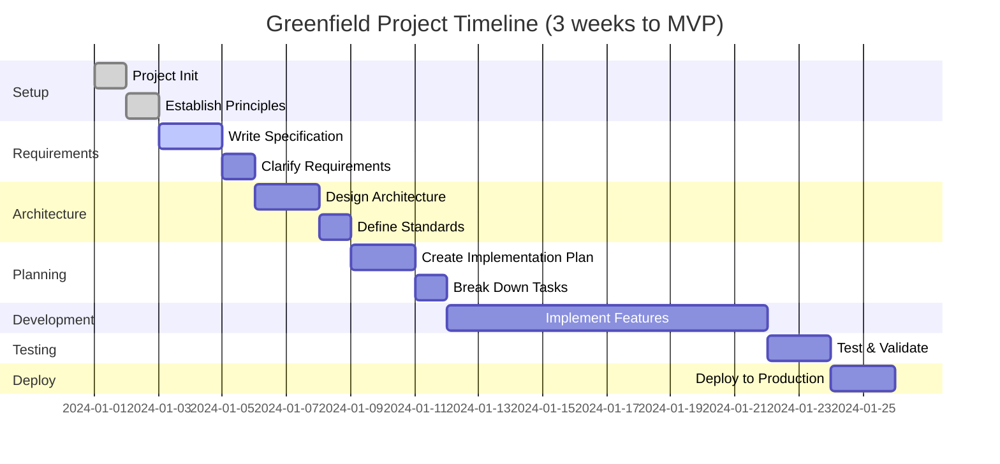

# 🌱 Greenfield Project Workflow

**Build new applications from scratch using Spec-Driven Development**

This guide shows you how to build a complete application from idea to production using the Hanoi Rainbow framework.

---

## 📋 Overview

**Greenfield projects** are brand new applications built from scratch. Hanoi Rainbow helps you:

- Start with clear specifications before coding
- Build systematically with AI assistance
- Ensure quality through structured validation
- Maintain consistency across the entire project

**Timeline**: Typically 2-4 weeks for an MVP, depending on complexity.

### Complete Greenfield Journey

```mermaid
graph TD
    A[💡 Idea] --> B[/rainbow.regulate<br/>Establish Principles]
    B --> C[/rainbow.specify<br/>Write Spec]
    C --> D[/rainbow.clarify<br/>Refine Requirements]
    D --> E[/rainbow.architect<br/>Design Architecture]
    E --> F[/rainbow.design<br/>Create Plan]
    F --> G[/rainbow.taskify<br/>Break Down Tasks]
    G --> H[/rainbow.implement<br/>Build Application]
    H --> I[✅ Testing & Validation]
    I --> J[🚀 Production Deployment]

    style A fill:#ffd43b
    style B fill:#74c0fc
    style C fill:#74c0fc
    style D fill:#a78bfa
    style E fill:#a78bfa
    style F fill:#a78bfa
    style G fill:#51cf66
    style H fill:#51cf66
    style I fill:#fb923c
    style J fill:#12b886
```

---

## 🎯 When to Use This Workflow

Use the greenfield workflow when you're:

- ✅ Starting a completely new application
- ✅ Building an MVP or prototype
- ✅ Creating a microservice from scratch
- ✅ Developing a proof of concept
- ✅ Building with a known tech stack

---

## 🚀 Complete Workflow

### Phase 0: Project Setup (Day 1)

#### Step 1: Initialize Rainbow Project

```bash
# Create new project
rainbow init my-project --ai claude

# Or with multiple AI agents
rainbow init my-project --ai claude,gemini,copilot

# Navigate to project
cd my-project
```

#### Step 2: Verify Installation

```bash
# Check that commands are available
claude  # or your chosen AI agent

# You should see /rainbow.* commands available
```

**✅ Success Criteria**:

- [ ] Project created with `.rainbow/` directory
- [ ] Git repository initialized
- [ ] AI agent recognizes `/rainbow.*` commands

---

### Phase 1: Define Project Principles (Day 1, ~1 hour)

#### Step 3: Establish Ground Rules

Launch your AI agent and run:

```bash
/rainbow.regulate Create principles for code quality, testing standards, user experience, and performance. Include guidance on architecture decisions, security requirements, and team practices.
```

**What Gets Created**: `memory/ground-rules.md` with:

- Code quality principles
- Testing standards
- UX guidelines
- Performance requirements
- Security standards
- Architecture principles

**Example Principles**:

```markdown
## Code Quality
- Write self-documenting code with clear naming
- Keep functions small and focused (< 50 lines)
- Prefer composition over inheritance

## Testing
- Minimum 80% code coverage
- Test-driven development for business logic
- Integration tests for API endpoints

## Performance
- API response time < 500ms (P95)
- Page load time < 2 seconds
- Support 10,000 concurrent users
```

**✅ Success Criteria**:

- [ ] `memory/ground-rules.md` exists
- [ ] Principles cover all major areas
- [ ] Team agrees on the principles

---

### Phase 2: Create Feature Specification (Days 1-2, ~4 hours)

#### Step 4: Write Functional Specification

```bash
/rainbow.specify Build a task management app where users can create projects, add tasks, assign team members, and track progress. Users should be able to drag tasks between status columns (To Do, In Progress, Done). Include real-time updates when team members make changes.
```

**What Gets Created**:

- New git branch: `001-task-management`
- Feature directory: `specs/001-task-management/`
- Specification: `specs/001-task-management/spec.md`

**Specification Includes**:

- Executive Summary
- User Stories
- Functional Requirements
- Success Criteria
- Acceptance Scenarios
- Assumptions
- Out of Scope

**✅ Success Criteria**:

- [ ] Feature branch created
- [ ] Spec.md is complete and clear
- [ ] No [NEEDS CLARIFICATION] markers remain
- [ ] Success criteria are measurable
- [ ] All user stories have acceptance criteria

---

#### Step 5: Clarify Underspecified Areas (Optional, ~30 min)

If specification needs refinement:

```bash
/rainbow.clarify
```

This runs structured questioning to:

- Identify ambiguities
- Clarify edge cases
- Define data requirements
- Specify error handling

**✅ Success Criteria**:

- [ ] All clarifications answered
- [ ] Spec updated with clarifications
- [ ] Requirements are unambiguous

---

### Phase 3: System Architecture (Day 2, ~3 hours - Once per Product)

#### Step 6: Create System Architecture (Product-Level)

```bash
/rainbow.architect Design architecture for a scalable web application with React frontend, Node.js backend, PostgreSQL database, and Redis caching. Use microservices pattern for core services. Deploy on AWS with Kubernetes.
```

**What Gets Created**:

- `docs/architecture.md` with:
  - C4 Model diagrams (Context, Container, Component)
  - Technology stack decisions
  - Architecture Decision Records (ADRs)
  - Quality attribute strategies
  - Deployment architecture

**Architecture Includes**:

- System context diagram
- Container architecture
- Component design
- Technology selections with rationale
- Non-functional requirements
- Security architecture
- Deployment strategy

**✅ Success Criteria**:

- [ ] Architecture document complete
- [ ] All major decisions documented as ADRs
- [ ] Technology stack approved by team
- [ ] Diagrams render correctly

---

#### Step 7: Define Coding Standards (Optional, Product-Level)

```bash
/rainbow.standardize Define coding standards for TypeScript/React frontend and Node.js backend. Include naming conventions, file organization, error handling patterns, and testing standards.
```

**What Gets Created**: `docs/standards.md`

---

### Phase 4: Technical Implementation Plan (Day 3, ~4 hours)

#### Step 8: Create Implementation Plan

```bash
/rainbow.design Use React with TypeScript for frontend, Node.js with Express for backend, PostgreSQL for database, Redis for caching. Implement WebSocket for real-time updates. Use Docker for containerization.
```

**What Gets Created**:

- `specs/001-task-management/design.md` - Implementation plan
- `specs/001-task-management/research.md` - Technical research
- `specs/001-task-management/data-model.md` - Database schema
- `specs/001-task-management/contracts/` - API specifications
- `specs/001-task-management/quickstart.md` - Setup guide

**Plan Includes**:

- Core implementation steps
- Data model design
- API contracts (OpenAPI/Swagger)
- Frontend components
- Testing strategy
- Deployment approach

**✅ Success Criteria**:

- [ ] Implementation plan is detailed and actionable
- [ ] Data model is normalized and complete
- [ ] API contracts are fully specified
- [ ] Dependencies are identified
- [ ] Testing strategy defined

---

#### Step 9: Analyze Plan Quality (Optional, ~30 min)

```bash
/rainbow.analyze
```

Performs cross-artifact analysis:

- Validates consistency between spec and plan
- Checks requirement coverage
- Identifies gaps or conflicts
- Suggests improvements

**✅ Success Criteria**:

- [ ] All requirements covered in plan
- [ ] No conflicts between spec and plan
- [ ] Dependencies properly sequenced

---

### Phase 5: Task Breakdown (Day 3, ~1 hour)

#### Step 10: Generate Task List

```bash
/rainbow.taskify
```

**What Gets Created**: `specs/001-task-management/tasks.md`

**Task List Includes**:

- Tasks organized by user story
- Dependencies marked
- Parallel tasks identified with [P]
- File paths for each task
- Test-first approach if requested
- Checkpoints for validation

**Example Tasks**:

```markdown
## Phase 1: Project Setup
- [ ] T001: Initialize Node.js project with TypeScript
- [ ] T002: Setup ESLint and Prettier
- [ ] T003: Configure Jest for testing
- [ ] T004: Setup Docker and docker-compose

## Phase 2: Database Layer
- [ ] T005: Create PostgreSQL schema
- [ ] T006: Setup TypeORM
- [ ] T007 [P]: Write database migrations
- [ ] T008 [P]: Create repository pattern
```

**✅ Success Criteria**:

- [ ] All user stories have tasks
- [ ] Dependencies are clear
- [ ] Tasks are granular (< 1 day each)
- [ ] File paths specified

---

### Phase 6: Implementation (Days 4-12, ~8-10 days)

#### Step 11: Execute Implementation

```bash
/rainbow.implement
```

**What Happens**:

1. Validates prerequisites (ground-rules, spec, plan, tasks)
2. Parses task breakdown
3. Executes tasks in correct order
4. Handles dependencies
5. Runs tests as specified
6. Reports progress

**The AI Agent Will**:

- Create project structure
- Install dependencies
- Write database schemas
- Implement API endpoints
- Build frontend components
- Write tests (unit, integration, e2e)
- Configure deployment
- Run quality checks

**Your Role**:

- Monitor progress
- Resolve errors as they occur
- Test the application manually
- Provide feedback on implementation

**✅ Success Criteria**:

- [ ] All tasks completed
- [ ] Tests passing
- [ ] Application runs locally
- [ ] No critical bugs
- [ ] Code follows standards

---

### Phase 7: Testing & Validation (Days 13-14, ~2 days)

#### Step 12: Run Application

```bash
# Start the application
npm run dev  # or docker-compose up

# Test functionality manually
# - Create projects
# - Add tasks
# - Drag and drop
# - Test real-time updates
# - Test edge cases
```

#### Step 13: Fix Issues

When you find bugs:

```bash
# Report issue to AI agent
There's a bug when dragging tasks: [describe the issue]. Check the TaskBoard.tsx component and fix the drag-and-drop logic.
```

The AI agent will:

- Investigate the issue
- Fix the bug
- Run tests
- Verify the fix

#### Step 14: Create Quality Checklist (Optional)

```bash
/rainbow.checklist Create a quality checklist for task management app covering functionality, usability, performance, and security
```

**What Gets Created**: `specs/001-task-management/checklists/quality.md`

**✅ Success Criteria**:

- [ ] All user acceptance scenarios pass
- [ ] Performance targets met
- [ ] Security checklist complete
- [ ] No critical or high bugs
- [ ] Ready for user testing

---

### Phase 8: End-to-End Testing (Optional, Days 15-16)

#### Step 15: Design E2E Test Specification

```bash
/rainbow.design-e2e-test Design comprehensive end-to-end tests for the task management app covering all user workflows
```

**What Gets Created**: `docs/e2e-test-spec.md`

#### Step 16: Execute E2E Tests

```bash
/rainbow.perform-e2e-test Execute end-to-end tests using Playwright/Cypress
```

**What Gets Created**: `docs/e2e-test-results.md`

**✅ Success Criteria**:

- [ ] All critical user paths tested
- [ ] E2E tests passing
- [ ] Test results documented

---

### Phase 9: Deployment Preparation (Day 17, ~1 day)

#### Step 17: Prepare for Deployment

Review deployment artifacts:

- [ ] Dockerfile and docker-compose.yml
- [ ] Environment variables documented
- [ ] Database migrations ready
- [ ] CI/CD pipeline configured
- [ ] Monitoring/logging setup
- [ ] Documentation complete

#### Step 18: Deploy to Staging

```bash
# Deploy to staging environment
./deploy-staging.sh

# Run smoke tests
npm run smoke-test
```

**✅ Success Criteria**:

- [ ] Application deployed successfully
- [ ] Smoke tests pass
- [ ] Performance acceptable
- [ ] No errors in logs

---

### Phase 10: Production Deployment (Day 18, ~1 day)

#### Step 19: Create Pull Request

```bash
# AI agent can create PR if you have gh CLI
Create a pull request for this feature with a detailed description of the implementation
```

#### Step 20: Deploy to Production

```bash
# After PR approval and merge
./deploy-production.sh

# Monitor
npm run monitor
```

#### Step 21: Post-Deployment Validation

- [ ] Application accessible
- [ ] All features working
- [ ] Performance metrics normal
- [ ] No errors in production logs
- [ ] User feedback collected

**✅ Success Criteria**:

- [ ] Application live in production
- [ ] Zero downtime deployment
- [ ] All health checks passing
- [ ] Team trained on maintenance

---

## 🎓 Best Practices

### Do's ✅

- **Start with principles** - Establish ground rules before anything else
- **Be specific in specs** - The clearer your specification, the better the output
- **Review at each phase** - Don't proceed until each phase is validated
- **Iterate on specs** - Use `/rainbow.clarify` to refine requirements
- **Test continuously** - Don't wait until the end to test
- **Use architecture docs** - Create `docs/architecture.md` once per product
- **Follow the order** - Each phase builds on the previous one

### Don'ts ❌

- **Don't skip ground rules** - They guide all subsequent decisions
- **Don't mix tech in specs** - Keep `/rainbow.specify` technology-agnostic
- **Don't implement without a plan** - Always create design before implementation
- **Don't skip task breakdown** - `/rainbow.taskify` ensures systematic implementation
- **Don't ignore validation** - Use checklists and analysis tools
- **Don't commit broken code** - Fix issues before moving forward

---

## 🔄 Iterating on Features

After your MVP is live, add new features:

```bash
# Create new feature
/rainbow.specify Add user notifications for task assignments and updates

# Follow the same workflow
/rainbow.clarify  # if needed
/rainbow.design Use existing architecture and add notification service
/rainbow.taskify
/rainbow.implement
```

**Key Differences for Iteration**:

- Ground rules already exist (use them)
- Architecture already exists (extend it)
- Standards already exist (follow them)
- New feature gets new branch (002-notifications, 003-reports, etc.)

---

## 📊 Example Timeline



| Phase | Duration | Key Deliverable |
|-------|----------|-----------------|
| Project Setup | 1 day | Initialized project |
| Principles | 1 day | Ground rules established |
| Specification | 2 days | Complete spec.md |
| Architecture | 2 days | Architecture.md (one-time) |
| Implementation Plan | 2 days | Design and contracts |
| Task Breakdown | 1 day | tasks.md |
| Implementation | 8-10 days | Working application |
| Testing | 2 days | Validated application |
| Deployment | 2 days | Production deployment |
| **Total** | **~3 weeks** | **Production MVP** |

---

## 🆘 Troubleshooting

### Issue: Specification is Too Vague

**Solution**: Use `/rainbow.clarify` to ask structured questions

### Issue: Implementation Gets Stuck

**Solution**:

1. Check that plan is detailed enough
2. Verify all dependencies are installed
3. Ask AI agent to break down complex tasks further
4. Review error logs and provide context to AI agent

### Issue: Tests Are Failing

**Solution**:

1. Review test failures with AI agent
2. Ask agent to fix specific test
3. Verify test expectations match spec

### Issue: Application Doesn't Match Spec

**Solution**:

1. Use `/rainbow.analyze` to check spec-plan alignment
2. Update plan to match spec
3. Re-run `/rainbow.implement` for affected tasks

---

## 📚 Next Steps

- **Add Features**: Use brownfield workflow for new features
- **Improve Quality**: Create custom checklists with `/rainbow.checklist`
- **Scale Architecture**: Update `docs/architecture.md` as needed
- **Modernize Later**: If building on legacy, see legacy modernization workflow

---

## 📖 Related Workflows

- **[Brownfield Workflow](brownfield-workflow.md)** - Adding features to existing projects
- **[Legacy Migration Workflow](legacy-migration-workflow.md)** - Migrating data from legacy systems
- **[Legacy Modernization Workflow](legacy-modernization-workflow.md)** - Modernizing mainframe applications

---

**🌈 Happy Building with Spec-Driven Development!**
