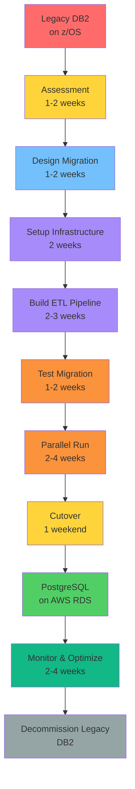
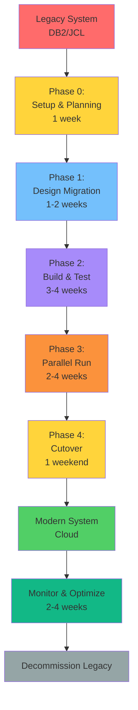
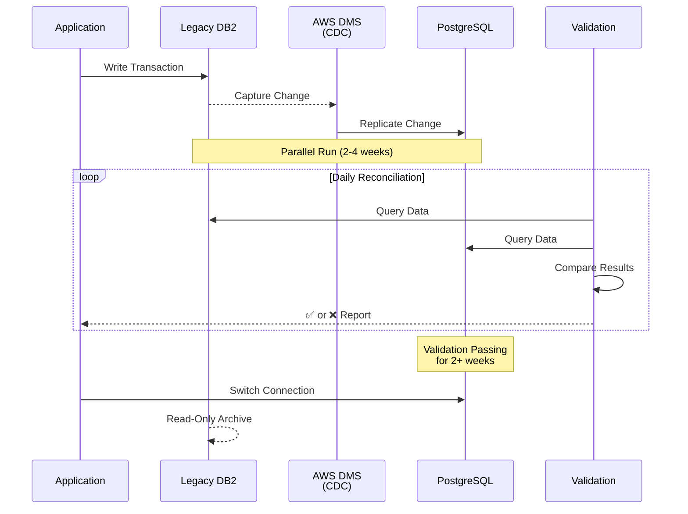
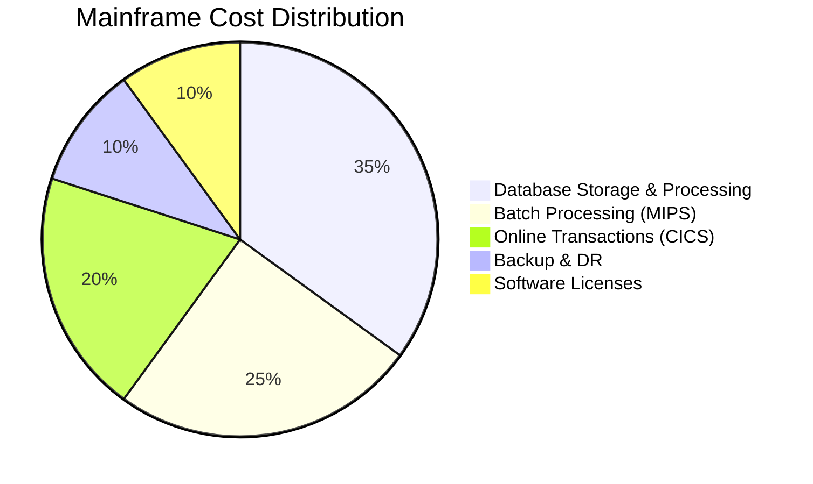
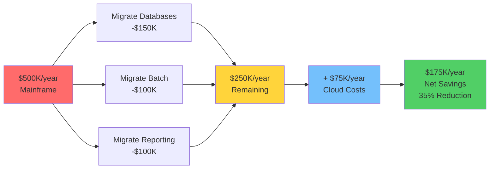

# 🔄 Legacy Migration Workflow

**Migrate specific components or data from legacy systems to modern platforms**

This guide shows you how to migrate data, batch jobs, or specific components from legacy systems without full modernization.

---

## 📋 Overview

**Legacy Migration** is focused on moving specific components while keeping the rest of the legacy system running. Use this when you need to:
- Migrate data from mainframe databases to cloud
- Move batch processing off the mainframe
- Offload specific workloads to reduce mainframe costs
- Extract data for analytics/reporting

**Timeline**: 4-12 weeks depending on data volume and complexity.

**Difference from Modernization**: Migration moves components "as-is" or with minimal changes. Modernization redesigns and rebuilds (see [Legacy Modernization Workflow](legacy-modernization-workflow.md)).

### Data Migration Journey



---

## 🎯 When to Use This Workflow

Use legacy migration when you:
- ✅ Need to reduce mainframe costs quickly
- ✅ Want to migrate data to cloud for analytics
- ✅ Need to offload batch processing
- ✅ Have clear business value in moving specific workloads
- ✅ Want to test migration approach before full modernization
- ✅ Need interim solution before full modernization

**Don't use this when**:
- ❌ You want to redesign the application (use modernization workflow)
- ❌ Business logic needs to change (use modernization workflow)
- ❌ You're building a new application (use greenfield workflow)

---

## 🚀 Complete Workflow

### Migration Process Overview



### Phase 0: Project Setup (Week 1)

#### Step 1: Initialize Rainbow Project

```bash
# Create migration project
rainbow init mainframe-migration --ai claude

cd mainframe-migration
```

#### Step 2: Establish Principles

```bash
/rainbow.regulate Create principles for legacy migration focusing on: data integrity, zero downtime, rollback procedures, validation rigor, and cost optimization. Include security and compliance requirements.
```

**Key Principles for Migration**:
- **Data Integrity**: Zero data loss tolerance
- **Business Continuity**: No disruption to operations
- **Validation**: Comprehensive reconciliation
- **Rollback**: Always have a way back
- **Compliance**: Maintain all regulatory requirements

**✅ Success Criteria**:
- [ ] Principles established
- [ ] Team aligned on approach
- [ ] Risk tolerance defined

---

### Phase 1: Data Migration Planning (Weeks 1-2)

#### Use Case: Migrate Customer Database from DB2 to PostgreSQL

#### Step 3: Assess Legacy Data

```bash
/rainbow.specify Migrate customer database from DB2 on z/OS to PostgreSQL on AWS RDS. Include all customer records (5M customers), transaction history (200GB), and related tables. Must maintain ACID properties and support existing queries. Zero downtime requirement.
```

**What Gets Created**:
- Feature branch: `001-db2-to-postgresql`
- `specs/001-db2-to-postgresql/spec.md`

**Specification Includes**:
- Data scope and volumes
- Data quality requirements
- Performance requirements
- Compliance requirements (GDPR, SOX, etc.)
- Cutover strategy
- Success criteria

#### Step 4: Design Data Migration

```bash
/rainbow.design-data-migration

Migrate from DB2 z/OS to PostgreSQL 15 on AWS RDS. Use AWS DMS for initial load and CDC for ongoing sync. Implement dual-write pattern during cutover. Plan for data validation and reconciliation. Maintain precision for DECIMAL fields.
```

**What Gets Created**:
- `specs/001-db2-to-postgresql/data-migration.md`

**Migration Plan Includes**:
- Source data analysis
- Target schema design
- Field-level mappings
- Data transformation rules
- ETL/ELT pipeline design
- Validation procedures
- Cutover strategy
- Rollback procedures

**✅ Success Criteria**:
- [ ] Complete source-to-target mapping
- [ ] Transformation rules defined
- [ ] Validation procedures defined
- [ ] Rollback plan documented

---

#### Step 5: Get Expert Guidance (Optional)

```bash
/hanoi.data-migration-engineer Review the data migration plan for our DB2 to PostgreSQL migration. Identify risks and suggest optimizations.
```

The agent will review and provide:
- Risk assessment
- Performance optimization suggestions
- Alternative approaches
- Best practices

---

### Phase 2: Migration Implementation (Weeks 3-6)

#### Step 6: Setup Infrastructure

**Tasks** (do these manually or with AI agent):
1. Provision target PostgreSQL database
2. Set up AWS DMS (Database Migration Service)
3. Configure network connectivity
4. Set up monitoring and logging
5. Create staging environment

#### Step 7: Implement ETL Pipeline

```bash
/rainbow.taskify
/rainbow.implement
```

**AI Agent Will**:
1. Create target schema with migrations
2. Implement ETL scripts
3. Configure AWS DMS
4. Create data validation queries
5. Implement reconciliation procedures
6. Set up monitoring
7. Create rollback scripts

**Key Components**:
- **Schema Creation**: PostgreSQL DDL scripts
- **Data Extraction**: DB2 queries
- **Transformation Logic**: Data cleansing and conversion
- **Loading Procedures**: Bulk insert optimizations
- **Validation Queries**: Row counts, checksums, sample verification

#### Step 8: Test Migration (Critical!)

```bash
# Test on sample data first
npm run migrate:test-sample

# Test on production copy
npm run migrate:test-full

# Validate results
npm run validate:reconcile
```

**Testing Steps**:
1. **Sample Test**: 1,000 records
2. **Medium Test**: 100,000 records
3. **Full Test**: Full production copy
4. **Performance Test**: Measure migration time
5. **Validation Test**: Verify data accuracy

**✅ Success Criteria**:
- [ ] Sample migration successful (100%)
- [ ] Full test migration successful
- [ ] Validation passing (< 0.01% discrepancy)
- [ ] Performance acceptable
- [ ] Rollback tested

---

### Phase 3: Parallel Run & Validation (Weeks 7-8)



#### Step 9: Implement CDC (Change Data Capture)

Set up real-time synchronization:
- AWS DMS continuous replication
- Monitor replication lag
- Handle conflicts
- Validate continuously

```bash
# Start CDC
aws dms start-replication-task --task-arn [ARN]

# Monitor
aws dms describe-replication-tasks
```

#### Step 10: Run Parallel Systems

**For 2-4 Weeks**:
- Legacy DB2 (primary)
- New PostgreSQL (syncing via CDC)
- Daily reconciliation
- Monitor for discrepancies

**Daily Checklist**:
- [ ] Replication lag < 5 seconds
- [ ] Row count discrepancy < 0.01%
- [ ] No errors in replication logs
- [ ] Performance metrics acceptable
- [ ] Test queries return same results

#### Step 11: Create Validation Checklist

```bash
/rainbow.checklist Create data migration validation checklist covering data integrity, performance, compliance, and cutover readiness
```

**Checklist Includes**:
- [ ] Data completeness validated
- [ ] Data accuracy verified
- [ ] Performance benchmarks met
- [ ] Compliance requirements validated
- [ ] Rollback procedures tested
- [ ] Team trained
- [ ] Cutover plan approved

**✅ Success Criteria**:
- [ ] 2+ weeks of successful parallel run
- [ ] All reconciliation passing
- [ ] Performance validated
- [ ] Stakeholder approval

---

### Phase 4: Cutover (Week 9)

#### Step 12: Final Cutover

**Cutover Steps** (typically during maintenance window):

```markdown
Hour 0:00 - Freeze legacy database (read-only mode)
Hour 0:05 - Final CDC synchronization
Hour 0:30 - Final data validation
Hour 1:00 - Switch application connections to PostgreSQL
Hour 1:15 - Smoke test application
Hour 1:30 - Monitor for errors
Hour 2:00 - Go/No-Go decision
Hour 2:30 - Open to users (if Go)
```

#### Step 13: Post-Cutover Validation

**First 24 Hours**:
- [ ] Application functioning normally
- [ ] No errors in logs
- [ ] Performance acceptable
- [ ] Data integrity maintained
- [ ] No user-reported issues

**First Week**:
- [ ] Daily reconciliation with legacy (read-only)
- [ ] Performance monitoring
- [ ] User acceptance
- [ ] Cost analysis

**✅ Success Criteria**:
- [ ] Zero downtime achieved
- [ ] All data migrated successfully
- [ ] Application working normally
- [ ] Performance meets targets
- [ ] Can decommission legacy database

---

## 📊 Example: Batch Job Migration

### Use Case: Migrate Nightly Batch Jobs from JCL to AWS Batch

#### Step 1: Assess Batch Jobs

```bash
/rainbow.specify Migrate nightly batch processing from z/OS JCL to AWS Batch. Current system runs 50 jobs processing transaction files, generating reports, and updating data warehouse. Jobs run sequentially with dependencies. Total runtime 4 hours.
```

#### Step 2: Design Batch Modernization

```bash
/rainbow.convert-batch

Migrate JCL jobs to containerized AWS Batch jobs. Use Docker containers with Python scripts. Orchestrate with AWS Step Functions. Store job status in DynamoDB. Implement parallel execution where possible to reduce runtime. Maintain same output formats.
```

**What Gets Created**:
- `specs/002-batch-migration/batch-modernization.md`

**Plan Includes**:
- Job inventory and dependencies
- Dependency graph
- Modern alternatives (AWS Batch + Step Functions)
- Containerization strategy
- Orchestration design
- Monitoring and alerting
- Cutover plan

#### Step 3: Implement Batch Migration

```bash
/rainbow.taskify
/rainbow.implement
```

**AI Agent Will**:
1. Create Docker containers for each job
2. Convert JCL logic to Python/Node.js
3. Create AWS Step Functions workflows
4. Implement error handling
5. Set up CloudWatch monitoring
6. Create deployment scripts

#### Step 4: Test and Cutover

1. **Test Phase** (2 weeks)
   - Run modern jobs in parallel with legacy
   - Compare outputs
   - Validate results match

2. **Cutover** (1 night)
   - Disable legacy jobs
   - Enable modern jobs
   - Monitor execution
   - Compare results

**Benefits**:
- 50% reduction in runtime (parallel execution)
- 30% cost reduction
- Better monitoring and alerting
- Easier to modify and maintain

---

## 🎓 Best Practices for Migration

### Do's ✅

- **Start Small**: Migrate non-critical data first
- **Test Extensively**: Test with production data copies
- **Validate Continuously**: Daily reconciliation during parallel run
- **Plan Rollback**: Always have a way back
- **Monitor Everything**: Comprehensive monitoring during migration
- **Document Everything**: Mappings, procedures, decisions
- **Involve SMEs**: Get input from people who know the legacy system
- **Compliance First**: Maintain all regulatory requirements

### Don'ts ❌

- **Don't Skip Validation**: Never trust migration without verification
- **Don't Ignore Performance**: Ensure target system can handle load
- **Don't Rush Cutover**: Wait until parallel run is stable
- **Don't Lose Precision**: Maintain DECIMAL precision for financial data
- **Don't Skip Rollback Testing**: Test rollback before cutover
- **Don't Migrate All at Once**: Phased approach reduces risk
- **Don't Ignore Legacy Logic**: Understand before migrating
- **Don't Forget Compliance**: Audit trails, encryption, retention policies

---

## 🔍 Migration Checklists

### Data Migration Checklist

Use the template:
```bash
# Located at:
commands/templates-for-commands/data-migration-readiness-checklist-template.md
```

**Key Items**:
- [ ] Source data model documented
- [ ] Target schema designed
- [ ] Data volumes quantified
- [ ] Transformation rules defined
- [ ] ETL/ELT pipeline tested
- [ ] Reconciliation automated
- [ ] Performance validated
- [ ] Rollback tested
- [ ] Team trained
- [ ] Stakeholders informed

### Batch Migration Checklist

Use the template:
```bash
# Located at:
commands/templates-for-commands/batch-modernization-checklist-template.md
```

**Key Items**:
- [ ] All jobs inventoried
- [ ] Dependencies mapped
- [ ] Modern alternatives selected
- [ ] Orchestration configured
- [ ] Output formats validated
- [ ] Error handling implemented
- [ ] Monitoring configured
- [ ] Performance benchmarked
- [ ] Parallel run successful

---

## 📊 Migration Timeline Examples

### Database Migration (5M Records, 200GB)

| Week | Phase | Activities |
|------|-------|------------|
| 1-2 | Planning | Assess, design, plan |
| 3-4 | Infrastructure | Setup, configure, test environment |
| 5-6 | Implementation | Build ETL, test with samples |
| 7-8 | Parallel Run | CDC sync, daily validation |
| 9 | Cutover | Final migration, validation |
| 10+ | Stabilization | Monitor, optimize, decommission legacy |

**Total**: ~10 weeks

### Batch Jobs Migration (50 Jobs)

| Week | Phase | Activities |
|------|-------|------------|
| 1 | Planning | Inventory, analyze dependencies |
| 2-3 | Design | Design modern solution, containers |
| 4-6 | Implementation | Convert jobs, build orchestration |
| 7-8 | Testing | Parallel run, output comparison |
| 9 | Cutover | Switch to modern jobs |
| 10+ | Optimization | Tune performance, reduce costs |

**Total**: ~10 weeks

---

## 🆘 Troubleshooting

### Issue: Data Discrepancies During Parallel Run

**Solution**:
1. Identify which records differ
2. Check transformation logic
3. Verify data types and precision
4. Check for timezone issues
5. Investigate replication lag
6. Add logging to track changes

### Issue: Performance Degradation

**Solution**:
1. Add database indexes
2. Optimize queries
3. Increase resource allocation
4. Use connection pooling
5. Implement caching
6. Profile slow queries

### Issue: Replication Lag

**Solution**:
1. Check network connectivity
2. Increase DMS instance size
3. Reduce transaction volume temporarily
4. Optimize source queries
5. Add read replicas

### Issue: Rollback Needed

**Solution**:
1. Stop application writes to new system
2. Switch connections back to legacy
3. Verify legacy data is current
4. Resume normal operations
5. Analyze failure cause
6. Fix issues before retry

---

## 💰 Cost Optimization





### Mainframe Cost Reduction

**Strategies**:
- Migrate large tables off mainframe → 30-40% cost reduction
- Offload batch processing → 20-30% cost reduction
- Move reporting/analytics → 40-50% cost reduction
- Reduce MIPS usage → Direct cost savings

**Example**:
- **Before**: $500K/year mainframe costs
- **Migrate 3 large databases**: -$150K (30%)
- **Migrate batch processing**: -$100K (20%)
- **After**: $250K/year (50% reduction)
- **Cloud costs**: +$75K/year
- **Net savings**: $175K/year

---

## 📚 Next Steps

- **Migrate More Components**: Repeat for other databases or batch jobs
- **Full Modernization**: Once comfortable, see [Legacy Modernization Workflow](legacy-modernization-workflow.md)
- **Optimize Cloud Costs**: Review cloud spend and optimize
- **Decommission Legacy**: Plan for final decommissioning

---

## 📖 Related Workflows

- **[Greenfield Workflow](greenfield-workflow.md)** - Building new applications
- **[Brownfield Workflow](brownfield-workflow.md)** - Adding features to existing projects
- **[Legacy Modernization Workflow](legacy-modernization-workflow.md)** - Complete mainframe modernization

---

## 🔗 Useful Commands

- `/rainbow.specify` - Define migration scope
- `/rainbow.design-data-migration` - Plan data migration
- `/rainbow.convert-batch` - Plan batch migration
- `/hanoi.data-migration-engineer` - Get expert data migration guidance
- `/hanoi.batch-modernization-engineer` - Get expert batch migration guidance
- `/rainbow.checklist` - Create validation checklists

---

**🌈 Migrate with Confidence!**
