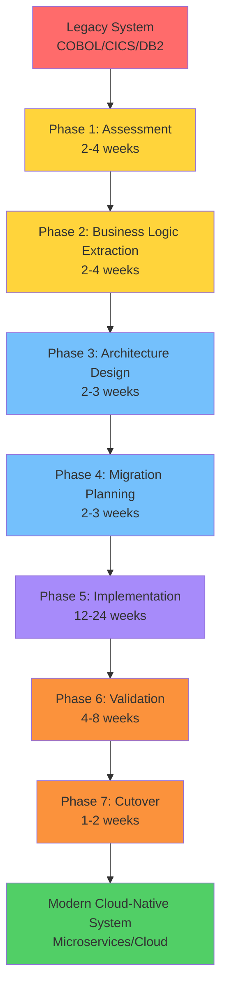
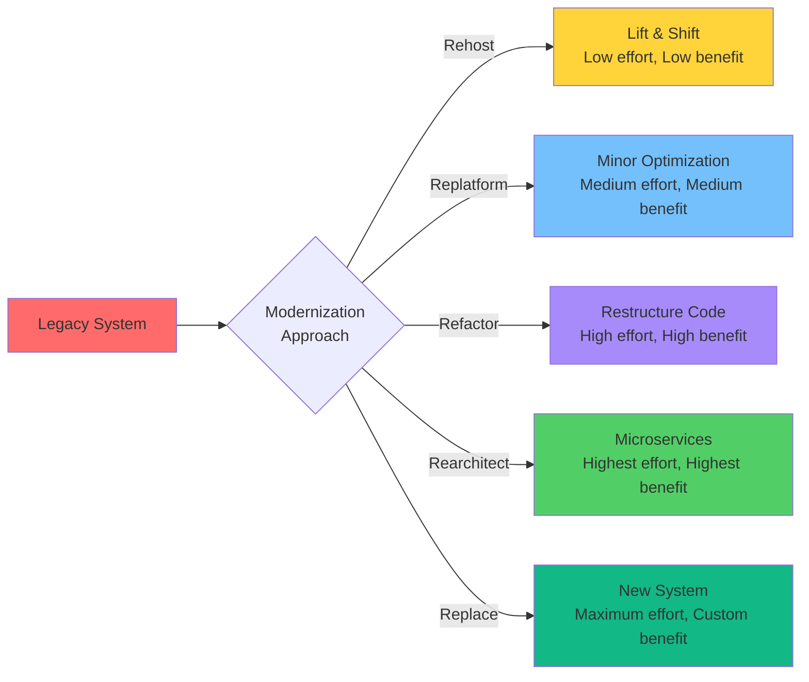
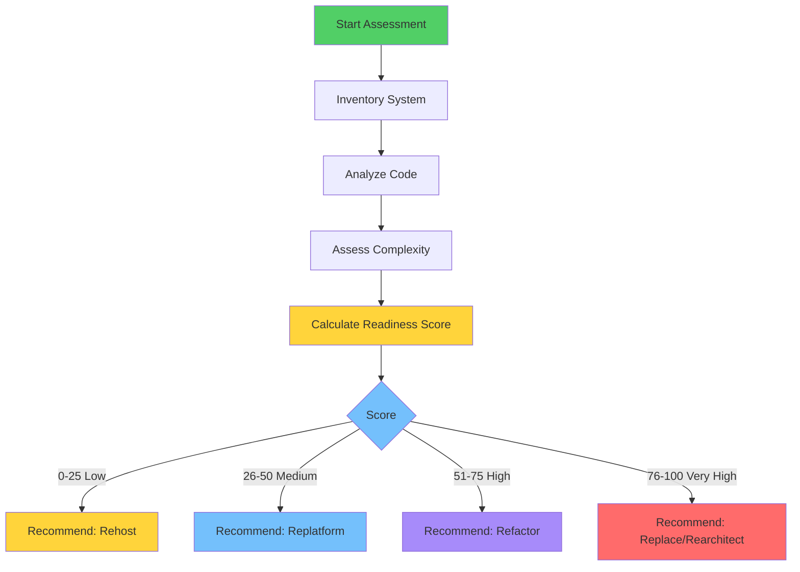
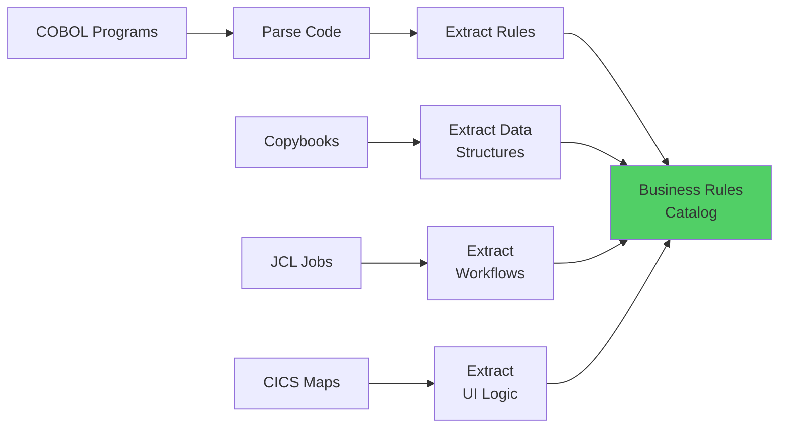
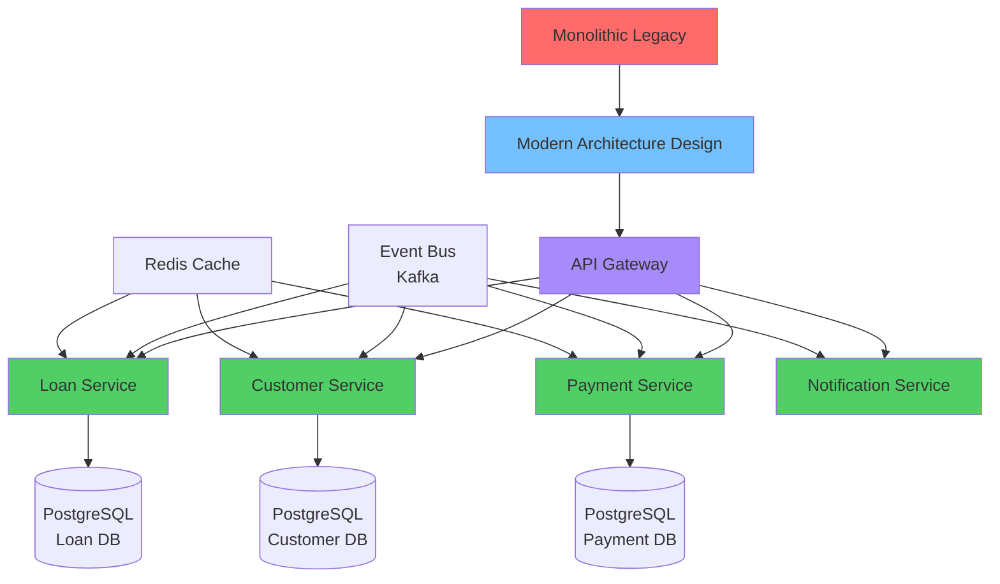
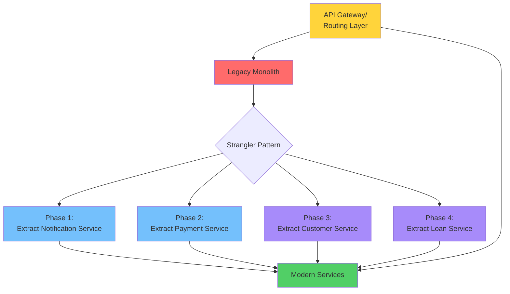
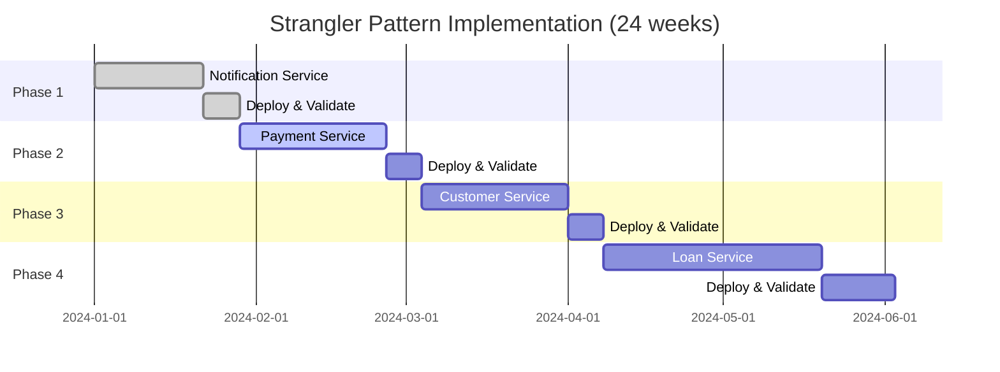
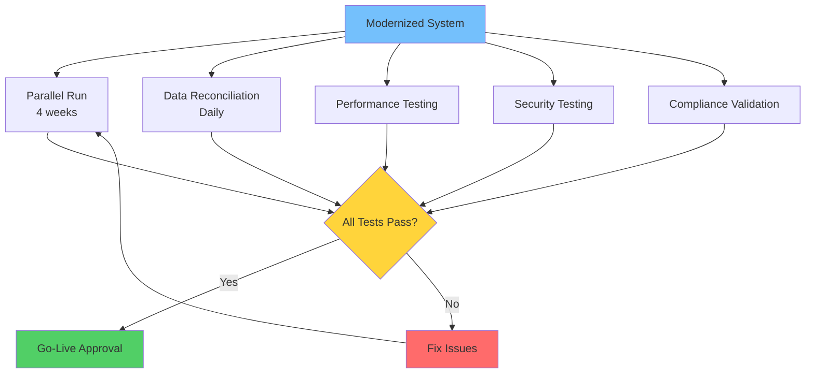
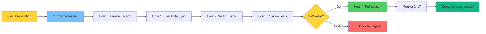

# 🏭 Legacy Modernization Workflow

**Systematically modernize mainframe and midrange applications to cloud-native architectures**

This comprehensive guide shows you how to modernize complete legacy systems (IBM mainframe, IBM i/AS400) to modern tech stacks while preserving business logic, ensuring compliance, and maintaining business continuity.

---

## 📋 Overview

**Legacy Modernization** is the complete transformation of mainframe/midrange applications to modern architectures. This involves:
- Analyzing legacy code (COBOL, RPG, PL/I, JCL)
- Extracting business logic
- Redesigning for cloud-native architecture
- Migrating data
- Modernizing batch processing
- Converting green-screen UIs
- Validating functional equivalence

**Timeline**: 6-18 months for complete system, depending on size and complexity.

**Investment**: Significant upfront cost, but 40-60% TCO reduction over 3-5 years.

---

## 🎯 When to Use This Workflow

Use legacy modernization when you:
- ✅ Want to eliminate mainframe dependency
- ✅ Need to reduce total cost of ownership
- ✅ Want modern cloud-native architecture
- ✅ Need to attract modern talent
- ✅ Want faster feature delivery
- ✅ Have executive commitment and budget
- ✅ Can tolerate 12-18 month timeline

**Don't use this when**:
- ❌ Just need to migrate data (use migration workflow)
- ❌ Building new application (use greenfield workflow)
- ❌ Adding features to existing modern app (use brownfield workflow)
- ❌ Lack executive support or budget
- ❌ Need results in < 6 months

---

## 🗺️ Complete Modernization Journey



---

## 📊 Modernization Approaches



**Recommended for Most**: **Refactor** or **Rearchitect** (Strangler Pattern)

---

## 🚀 Complete Workflow

### Phase 0: Project Initialization (Week 1)

#### Step 1: Initialize Modernization Project

```bash
# Create modernization project
rainbow init mainframe-modernization --ai claude,gemini

cd mainframe-modernization
```

#### Step 2: Establish Modernization Principles

```bash
/rainbow.regulate Create principles for legacy modernization focusing on: business continuity, data integrity, functional equivalence, regulatory compliance, iterative delivery, and risk mitigation. Include principles for testing, validation, and rollback.
```

**Key Principles**:
- **Business Continuity**: Zero disruption during modernization
- **Functional Equivalence**: Preserve all business logic exactly
- **Iterative Delivery**: Phased approach with frequent validation
- **Risk Mitigation**: Always have rollback capability
- **Compliance**: Maintain SOX/GDPR/HIPAA requirements throughout

**✅ Success Criteria**:
- [ ] Modernization principles established
- [ ] Executive sponsorship secured
- [ ] Budget approved
- [ ] Team assembled
- [ ] Timeline agreed

---

### Phase 1: Legacy System Assessment (Weeks 2-5, ~4 weeks)



#### Step 3: Create Assessment Specification

```bash
/rainbow.specify Assess our banking core system running on z/OS. System processes 1M transactions/day, has 500 COBOL programs (2M LOC), 200 DB2 tables (500GB), 100 batch jobs (JCL), and 150 CICS screens. Critical for business with 99.95% uptime requirement.
```

**What Gets Created**:
- Feature branch: `001-system-assessment`
- `specs/001-system-assessment/spec.md`

#### Step 4: Perform Comprehensive Assessment

```bash
/rainbow.assess-legacy Analyze complete banking core system on z/OS including all COBOL programs, JCL batch jobs, DB2 database, CICS transactions, and integrations with external systems.
```

**What Gets Created**:
- `specs/001-system-assessment/legacy-assessment.md`

**Assessment Includes**:
- System inventory (hardware, software, languages, versions)
- Code analysis (LOC, complexity metrics, dependencies)
- Business capability catalog
- Data architecture analysis
- Integration landscape
- Performance baselines
- Complexity score (0-100)
- Modernization readiness
- Recommended approach

#### Step 5: Get Expert Analysis

```bash
/hanoi.legacy-analyst Review the assessment and provide deep analysis of code complexity, technical debt, and modernization challenges. Identify high-risk areas.
```

**Expert Analysis Provides**:
- Detailed code complexity analysis
- Technical debt prioritization
- Risk assessment
- Effort estimates by component
- Recommended modernization sequence

**✅ Success Criteria**:
- [ ] Complete system inventory
- [ ] Complexity score calculated
- [ ] Risks identified
- [ ] Modernization approach recommended
- [ ] Business case approved

**Complexity Score Example**:
```
Complexity = (Code × 0.40) + (Data × 0.25) + (Integration × 0.20) + (Criticality × 0.15)
           = (65 × 0.40) + (55 × 0.25) + (45 × 0.20) + (85 × 0.15)
           = 26 + 13.75 + 9 + 12.75
           = 61.5 (High Complexity → Refactor Recommended)
```

---

### Phase 2: Business Logic Extraction (Weeks 6-9, ~4 weeks)



#### Step 6: Map Business Logic

```bash
/rainbow.map-business-logic Extract all business rules from loan processing COBOL programs. Focus on: interest calculation formulas, approval logic, validation rules, fee calculations, and state transitions. Include regulatory compliance rules.
```

**What Gets Created**:
- `specs/002-business-logic/business-logic-map.md`

**Business Logic Map Includes**:
- Business Rules Catalog (all rules with IDs)
- Data Validations (field-level and cross-field)
- Calculations & Formulas (with precision requirements)
- Business Workflows (state machines, decision trees)
- Exception Handling (error conditions, compensating transactions)
- Regulatory Requirements (compliance rules, audit requirements)

**Example Extracted Rules**:
```markdown
| Rule ID | Description | Source | Criticality |
|---------|-------------|--------|-------------|
| BR-001 | Interest = Principal × Rate / 100 (6 decimal precision) | LN100.COB:145 | Must-have |
| BR-002 | Loan approved if: Credit Score > 650 AND DTI < 43% | LN200.COB:234 | Must-have |
| BR-003 | Late fee = $25 if payment > 15 days overdue | LN300.COB:89 | Must-have |
```

#### Step 7: Get Business Analyst Validation

```bash
/hanoi.business-analyst Review extracted business rules with SMEs. Validate completeness and accuracy. Identify missing rules or edge cases.
```

**✅ Success Criteria**:
- [ ] All business rules extracted and cataloged
- [ ] SMEs validate rules for accuracy
- [ ] Regulatory requirements identified
- [ ] Precision requirements documented
- [ ] Edge cases identified

---

### Phase 3: Modern Architecture Design (Weeks 10-12, ~3 weeks)



#### Step 8: Design Target Architecture

```bash
/rainbow.architect Design cloud-native microservices architecture for banking core system. Use: React frontend, Node.js/Java microservices, PostgreSQL databases, Kafka for events, Redis for caching, Kubernetes on AWS. Follow 12-factor app principles.
```

**What Gets Created**:
- `docs/architecture.md`

**Architecture Includes**:
- C4 Model diagrams (Context, Container, Component)
- Microservices boundaries
- Technology stack with rationale
- ADRs for major decisions
- API design patterns
- Data architecture
- Security architecture
- Deployment strategy

#### Step 9: Get Architect Review

```bash
/hanoi.mainframe-architect Review proposed architecture for mainframe modernization. Ensure: scalability, security, compliance, cost-effectiveness, and migration feasibility.
```

**Architecture Validates**:
- Microservices boundaries are correct
- Technology choices appropriate
- Performance targets achievable
- Cost projections realistic
- Migration path feasible

**✅ Success Criteria**:
- [ ] Complete architecture documented
- [ ] Technology stack approved
- [ ] ADRs document key decisions
- [ ] Cost projections validated
- [ ] Security reviewed

---

### Phase 4: Migration Strategy & Planning (Weeks 13-15, ~3 weeks)



#### Step 10: Plan Data Migration

```bash
/rainbow.design-data-migration Plan migration from DB2 z/OS to PostgreSQL on AWS RDS. Migrate 200 tables (500GB data). Use AWS DMS for CDC replication. Plan dual-write strategy. Maintain DECIMAL precision for financial data.
```

**What Gets Created**:
- `specs/003-data-migration/data-migration.md`

**Data Migration Plan Includes**:
- Source-to-target schema mapping
- Data transformation rules
- ETL/ELT pipeline design
- Validation procedures
- Performance optimization
- Cutover strategy

#### Step 11: Plan Batch Modernization

```bash
/rainbow.convert-batch Modernize 100 JCL batch jobs to Kubernetes CronJobs with Airflow orchestration. Convert COBOL batch programs to Python/Java. Implement parallel execution. Reduce 6-hour runtime to 2 hours.
```

**What Gets Created**:
- `specs/004-batch-modernization/batch-modernization.md`

**Batch Modernization Plan Includes**:
- Job inventory and dependency graph
- Job classification (short/medium/long)
- Modern alternatives (K8s Jobs, serverless)
- Orchestration design (Airflow DAGs)
- Monitoring and alerting
- Performance optimization

#### Step 12: Plan Screen Migration

```bash
/rainbow.design-screen-migration Convert 150 CICS 3270 screens to React web application. Improve UX by consolidating screens, adding search, and real-time updates. Design responsive mobile-friendly interface. Maintain core workflows.
```

**What Gets Created**:
- `specs/005-screen-migration/screen-migration.md`

**Screen Migration Plan Includes**:
- Screen inventory
- Navigation flow analysis
- Modern UI wireframes
- UX improvements
- API requirements
- Accessibility requirements

#### Step 13: Create Strangler Pattern Plan

```bash
/rainbow.plan-strangler Design phased strangler pattern implementation. Extract services in this order: 1) Notification (low risk), 2) Payment, 3) Customer, 4) Loan (core). Use API Gateway for routing. Plan 8-phase rollout over 12 months.
```

**What Gets Created**:
- `specs/006-strangler-plan/strangler-plan.md`

**Strangler Plan Includes**:
- Service extraction sequence
- Phase-by-phase roadmap
- Routing architecture
- Data synchronization strategy
- Integration patterns
- Risk mitigation
- Success criteria for each phase

**✅ Success Criteria**:
- [ ] Complete migration strategy documented
- [ ] Phased approach defined
- [ ] Risk mitigation planned
- [ ] Timeline realistic
- [ ] Budget allocated

---

### Phase 5: Iterative Implementation (Weeks 16-40, ~24 weeks)

#### Strangler Pattern Execution



#### Phase 1: Extract Notification Service (Weeks 16-19)

**Step 14**: Specify and Design
```bash
/rainbow.specify Notification Service: Send emails and SMS for loan events
/rainbow.design Use Node.js, SendGrid for email, Twilio for SMS
/rainbow.taskify
```

**Step 15**: Implement and Test
```bash
/rainbow.implement
# Test notification service
# Deploy to staging
# Cutover 10% traffic
# Validate
# Gradually increase to 100%
```

**✅ Phase 1 Success Criteria**:
- [ ] Notification service deployed
- [ ] 100% traffic cutover
- [ ] No errors
- [ ] Legacy code removed

#### Phase 2-8: Continue Pattern (Weeks 20-40)

Repeat for each service:
1. **Payment Service** (4 weeks)
2. **Customer Service** (4 weeks)  
3. **Loan Service - Core** (6 weeks)
4. **Reporting Service** (3 weeks)
5. **Integration Service** (3 weeks)
6. **Batch Processing** (4 weeks)
7. **Final Cleanup** (2 weeks)

**For Each Phase**:
```bash
# 1. Specify the service
/rainbow.specify [Service description]

# 2. Design the service
/rainbow.design [Technical approach]

# 3. Break down tasks
/rainbow.taskify

# 4. Implement
/rainbow.implement

# 5. Test thoroughly
# - Unit tests
# - Integration tests  
# - E2E tests
# - Load tests

# 6. Deploy with canary/blue-green
# - 10% traffic
# - Monitor
# - Gradually increase
# - 100% cutover

# 7. Validate
# - Functional equivalence
# - Performance
# - No errors
```

**✅ Implementation Success Criteria**:
- [ ] All 8 phases completed
- [ ] All services deployed
- [ ] Legacy code progressively removed
- [ ] No major incidents

---

### Phase 6: Comprehensive Validation (Weeks 41-48, ~8 weeks)



#### Step 16: Design Validation Strategy

```bash
/rainbow.validate-modernization Design comprehensive validation for modernized banking system. Include: parallel run strategy (4 weeks), data reconciliation (daily), financial calculation validation (100% accuracy), performance benchmarking, and compliance audit.
```

**What Gets Created**:
- `specs/007-validation/modernization-validation.md`

**Validation Plan Includes**:
- Parallel run strategy (legacy + modern simultaneously)
- Data reconciliation procedures
- Test scenarios (10,000+ test cases)
- Performance benchmarks
- Compliance validation
- Go-live criteria

#### Step 17: Execute Parallel Run

**4-Week Parallel Run**:
```markdown
Week 1: Shadow mode (modern processes but doesn't affect users)
Week 2: 10% production traffic to modern system
Week 3: 50% production traffic to modern system
Week 4: 100% validation - both systems process everything
```

**Daily Activities**:
- [ ] Compare outputs from both systems
- [ ] Reconcile data (< 0.01% discrepancy)
- [ ] Monitor performance
- [ ] Check error rates
- [ ] Validate financial calculations

#### Step 18: Get Testing Expert Support

```bash
/hanoi.mainframe-tester Design comprehensive test suite for functional equivalence. Include: regression tests, financial calculation validation, integration tests, and compliance tests.
```

**✅ Validation Success Criteria**:
- [ ] 4 weeks parallel run successful
- [ ] Data reconciliation < 0.01% discrepancy
- [ ] Performance meets or exceeds legacy
- [ ] 100% financial calculation accuracy
- [ ] Zero critical bugs
- [ ] Compliance validated
- [ ] Stakeholder approval

---

### Phase 7: Final Cutover & Decommissioning (Weeks 49-50, ~2 weeks)



#### Step 19: Final Cutover

**Cutover Plan** (typically over a weekend):

```markdown
Friday 6PM: Start cutover procedures
Friday 8PM: Freeze legacy system (read-only)
Friday 9PM: Final data synchronization
Saturday 12AM: Switch all traffic to modern system
Saturday 1AM: Comprehensive smoke tests
Saturday 2AM: Monitor all services
Saturday 3AM: Go/No-Go decision
Saturday 4AM: Full production launch (if Go)
Saturday 4AM+: 24x7 monitoring for 1 week
```

**Go-Live Criteria**:
- [ ] All services healthy
- [ ] Data integrity validated
- [ ] Performance acceptable
- [ ] No critical errors
- [ ] Rollback tested and ready

#### Step 20: Hypercare Period (Weeks 51-54, ~4 weeks)

**First 24 Hours**:
- 24x7 monitoring
- War room staffed
- Executive updates every 2 hours
- Immediate issue response

**First Week**:
- Daily reconciliation with legacy (read-only)
- Daily status reports
- Performance monitoring
- Issue triage and resolution

**Weeks 2-4**:
- Weekly reconciliation
- Performance tuning
- Cost optimization
- User training
- Documentation finalization

#### Step 21: Legacy Decommissioning

**Week 8-12 After Cutover**:
- [ ] Verify modern system stable (4+ weeks)
- [ ] Export/archive legacy data for compliance
- [ ] Document decommissioning procedures
- [ ] Obtain final approvals
- [ ] Shutdown legacy systems
- [ ] Cancel mainframe contracts
- [ ] Celebrate success! 🎉

**✅ Final Success Criteria**:
- [ ] Modern system in production
- [ ] Legacy system decommissioned
- [ ] Cost savings realized
- [ ] Team trained
- [ ] Documentation complete
- [ ] Lessons learned documented

---

## 📊 Modernization Metrics

### Before vs After Comparison

| Metric | Legacy (z/OS) | Modern (Cloud) | Improvement |
|--------|---------------|----------------|-------------|
| **Infrastructure Cost** | $500K/year | $200K/year | 60% reduction |
| **Development Velocity** | 2 releases/year | 24 releases/year | 12x faster |
| **Deployment Time** | 4 hours | 15 minutes | 16x faster |
| **Incident Response** | 2 hours MTTR | 15 minutes MTTR | 8x faster |
| **New Developer Onboarding** | 6 months | 2 weeks | 12x faster |
| **System Availability** | 99.5% | 99.95% | 0.45% improvement |

### ROI Calculation

```
Investment:
- Assessment & Planning: $200K
- Implementation (24 weeks × $50K): $1.2M
- Migration Tools & Infrastructure: $100K
- Training: $50K
Total: $1.55M

Annual Savings:
- Infrastructure: $300K/year
- Maintenance: $200K/year  
- Faster development: $150K/year
Total: $650K/year

ROI: 2.4 years payback
5-year TCO savings: $1.7M (52% reduction)
```

---

## 🎓 Best Practices

### Do's ✅

- **Start with Assessment**: Understand complexity before committing
- **Extract Business Logic**: Document all rules before coding
- **Use Strangler Pattern**: Incremental migration reduces risk
- **Validate Continuously**: Parallel run for weeks/months
- **Maintain Precision**: Financial calculations must be exact
- **Test Exhaustively**: 100% functional equivalence required
- **Plan Rollback**: Always have an escape hatch
- **Celebrate Wins**: Each phase success builds momentum

### Don'ts ❌

- **Don't Rush**: Modernization takes time - plan accordingly
- **Don't Skip Assessment**: Poor understanding = poor outcomes
- **Don't Big Bang**: Incremental approach is safer
- **Don't Ignore SMEs**: They know the business logic
- **Don't Compromise Quality**: Bugs in banking = lost trust
- **Don't Forget Compliance**: Regulatory requirements are non-negotiable
- **Don't Ignore Culture**: Change management is critical
- **Don't Underfund**: Insufficient budget = failure

---

## 🆘 Troubleshooting

### Issue: Discrepancies in Financial Calculations

**Solution**:
```bash
/hanoi.cobol-translator Review COBOL calculation logic and ensure DECIMAL precision is preserved in modern code. Use BigDecimal (Java) or decimal (Python) for financial fields.
```

### Issue: Performance Degradation

**Solution**:
1. Profile both systems
2. Identify bottlenecks
3. Add database indexes
4. Implement caching
5. Optimize N+1 queries
6. Scale horizontally

### Issue: Integration Failures

**Solution**:
1. Review integration contracts
2. Test each integration independently
3. Implement retry logic
4. Add circuit breakers
5. Monitor integration health

---

## 📚 Complete Command Reference

| Command | Purpose | When to Use |
|---------|---------|-------------|
| `/rainbow.assess-legacy` | Analyze legacy system | Phase 1: Assessment |
| `/rainbow.map-business-logic` | Extract business rules | Phase 2: Logic extraction |
| `/rainbow.architect` | Design modern architecture | Phase 3: Architecture |
| `/rainbow.design-data-migration` | Plan data migration | Phase 4: Planning |
| `/rainbow.convert-batch` | Modernize batch jobs | Phase 4: Planning |
| `/rainbow.design-screen-migration` | Convert UI | Phase 4: Planning |
| `/rainbow.plan-strangler` | Phased migration plan | Phase 4: Planning |
| `/rainbow.specify` | Define each service | Phase 5: Implementation |
| `/rainbow.design` | Design each service | Phase 5: Implementation |
| `/rainbow.taskify` | Break down tasks | Phase 5: Implementation |
| `/rainbow.implement` | Build each service | Phase 5: Implementation |
| `/rainbow.validate-modernization` | Validate equivalence | Phase 6: Validation |

### Specialized Agents

| Agent | Expertise | When to Use |
|-------|-----------|-------------|
| `/hanoi.legacy-analyst` | Code analysis | Deep code review |
| `/hanoi.mainframe-architect` | Migration architecture | Architecture design |
| `/hanoi.data-migration-engineer` | Data migration | Data strategy |
| `/hanoi.batch-modernization-engineer` | Batch processing | Batch migration |
| `/hanoi.cobol-translator` | Code translation | Precision validation |
| `/hanoi.mainframe-tester` | Testing & validation | Equivalence testing |

---

## 📖 Related Workflows

- **[Greenfield Workflow](greenfield-workflow.md)** - Building new applications
- **[Brownfield Workflow](brownfield-workflow.md)** - Adding features
- **[Legacy Migration Workflow](legacy-migration-workflow.md)** - Targeted migration

---

**🌈 Transform with Confidence! Your Mainframe Modernization Journey Starts Here!**
