# 🗺️ Hanoi Rainbow Workflows Guide

**Choose the right workflow for your project type**

This guide helps you select and navigate the appropriate Spec-Driven Development workflow for your specific use case.

---

## 🧭 Quick Navigator

```mermaid
graph TD
    A[Your Project] --> B{What are you doing?}

    B -->|Building from scratch| C[🌱 Greenfield Workflow]
    B -->|Adding to existing app| D[🏗️ Brownfield Workflow]
    B -->|Migrating data/batch| E[🔄 Legacy Migration Workflow]
    B -->|Modernizing mainframe| F[🏭 Legacy Modernization Workflow]

    C --> G[New application<br/>MVP in 2-4 weeks]
    D --> H[New features<br/>1-2 weeks each]
    E --> I[Data/batch migration<br/>4-12 weeks]
    F --> J[Complete modernization<br/>6-18 months]

    style A fill:#ffd43b
    style C fill:#51cf66
    style D fill:#74c0fc
    style E fill:#a78bfa
    style F fill:#ff6b6b
```



---

## 📚 Workflow Comparison

| Workflow | Best For | Timeline | Complexity | Commands Used |
|----------|----------|----------|------------|---------------|
| **[Greenfield](greenfield-workflow.md)** | New applications from scratch | 2-4 weeks (MVP) | Low-Medium | regulate, specify, architect, design, taskify, implement |
| **[Brownfield](brownfield-workflow.md)** | Adding features to existing apps | 1-2 weeks/feature | Low-Medium | specify, design, taskify, implement |
| **[Migration](legacy-migration-workflow.md)** | Moving specific components | 4-12 weeks | Medium | specify, design-data-migration, convert-batch |
| **[Modernization](legacy-modernization-workflow.md)** | Complete mainframe transformation | 6-18 months | High | All commands including mainframe-specific |

---

## 🎯 Decision Tree

### Question 1: Are you working with legacy systems?

**NO** → Go to Question 2
**YES** → Go to Question 3

### Question 2: Is this a brand new application?

**YES** → Use **[Greenfield Workflow](greenfield-workflow.md)**
- Starting from scratch
- No existing codebase
- Clear tech stack choice

**NO** → Use **[Brownfield Workflow](brownfield-workflow.md)**
- Adding features to existing modern application
- Existing codebase and architecture
- Extending current functionality

### Question 3: What's your goal with the legacy system?

**Migrate specific components only** → Use **[Legacy Migration Workflow](legacy-migration-workflow.md)**
- Just moving data to cloud
- Just offloading batch processing
- Want quick wins and cost reduction
- Keep most of legacy system running

**Complete modernization** → Use **[Legacy Modernization Workflow](legacy-modernization-workflow.md)**
- Eliminate mainframe dependency
- Redesign to cloud-native architecture
- Transform COBOL to modern languages
- Replace green screens with modern UI
- 12-18 month commitment

---

## 🌱 Greenfield Workflow

**[Full Guide →](greenfield-workflow.md)**

### When to Use
- Building a new application from scratch
- Creating an MVP or prototype
- Starting a new microservice
- No existing codebase

### Key Steps
1. `rainbow init` - Initialize project
2. `/rainbow.regulate` - Establish principles
3. `/rainbow.specify` - Define requirements
4. `/rainbow.architect` - Design architecture (once per product)
5. `/rainbow.design` - Create implementation plan
6. `/rainbow.taskify` - Break down tasks
7. `/rainbow.implement` - Build application
8. Test and deploy

### Timeline
**2-4 weeks** for MVP

### Example
Build a task management SaaS application with React frontend, Node.js backend, and PostgreSQL database.

---

## 🏗️ Brownfield Workflow

**[Full Guide →](brownfield-workflow.md)**

### When to Use
- Adding features to existing modern applications
- Enhancing existing functionality
- Refactoring existing modules
- Working with established codebase

### Key Steps
1. `rainbow init --here` - Add Rainbow to existing project
2. Document existing architecture (if not done)
3. `/rainbow.specify` - Define new feature
4. `/rainbow.design` - Plan integration with existing system
5. `/rainbow.taskify` - Break down tasks
6. `/rainbow.implement` - Add feature
7. Test for regressions
8. Deploy

### Timeline
**1-2 weeks** per feature

### Example
Add user notification system to existing task management app.

---

## 🔄 Legacy Migration Workflow

**[Full Guide →](legacy-migration-workflow.md)**

### When to Use
- Migrating data from mainframe to cloud
- Offloading batch processing
- Moving specific workloads
- Quick cost reduction needed
- Testing migration before full modernization

### Key Steps
1. `rainbow init` - Initialize migration project
2. `/rainbow.specify` - Define migration scope
3. `/rainbow.design-data-migration` - Plan data migration
4. `/rainbow.convert-batch` - Plan batch migration (if applicable)
5. Implement ETL/ELT pipelines
6. Test thoroughly
7. Parallel run (2-4 weeks)
8. Cutover
9. Validate and optimize

### Timeline
**4-12 weeks** depending on data volume

### Example
Migrate 500GB customer database from DB2 on z/OS to PostgreSQL on AWS RDS.

### Cost Impact
Typically **30-50% mainframe cost reduction** from targeted migration.

---

## 🏭 Legacy Modernization Workflow

**[Full Guide →](legacy-modernization-workflow.md)**

### When to Use
- Complete mainframe/midrange modernization
- Eliminate legacy dependency entirely
- Transform to cloud-native architecture
- Long-term strategic initiative
- Executive commitment secured

### Key Steps

**Phase 1: Assessment (4 weeks)**
1. `/rainbow.assess-legacy` - Analyze legacy system
2. Review assessment results and calculate complexity

**Phase 2: Business Logic Extraction (4 weeks)**
3. `/rainbow.map-business-logic` - Extract all business rules
4. Validate extracted business rules with SMEs

**Phase 3: Architecture Design (3 weeks)**
5. `/rainbow.architect` - Design modern architecture
6. Review and validate migration strategy

**Phase 4: Migration Planning (3 weeks)**
7. `/rainbow.design-data-migration` - Plan data strategy
8. `/rainbow.convert-batch` - Plan batch modernization
9. `/rainbow.design-screen-migration` - Plan UI modernization
10. `/rainbow.plan-strangler` - Create phased roadmap

**Phase 5: Implementation (24+ weeks)**
12. Execute strangler pattern - service by service
13. For each service: specify → design → taskify → implement

**Phase 6: Validation (8 weeks)**
14. `/rainbow.validate-modernization` - Comprehensive validation
15. Parallel run for 4+ weeks

**Phase 7: Cutover (2 weeks)**
17. Final cutover
18. Hypercare
19. Decommission legacy

### Timeline
**6-18 months** for complete system

### Example
Modernize banking core system from COBOL/CICS/DB2 to Java microservices on Kubernetes.

### Cost Impact
**40-60% TCO reduction** over 3-5 years after 12-18 month investment.

---

## 🎨 Workflow Selection Matrix


---

## 🔧 Commands by Workflow

### Greenfield Commands
```bash
/rainbow.regulate          # Establish principles
/rainbow.specify           # Define requirements
/rainbow.clarify           # Refine requirements (optional)
/rainbow.architect         # Design architecture (once per product)
/rainbow.standardize       # Define coding standards (optional, once per product)
/rainbow.design            # Create implementation plan
/rainbow.analyze           # Validate plan quality (optional)
/rainbow.taskify           # Break down tasks
/rainbow.implement         # Build application
/rainbow.checklist         # Create quality checklists (optional)
/rainbow.design-e2e-test   # Design E2E tests (optional)
/rainbow.perform-e2e-test  # Run E2E tests (optional)
```

### Brownfield Commands
```bash
# If Rainbow not initialized:
rainbow init --here --ai claude

# Then same as greenfield, but:
# - Skip /rainbow.architect if docs/architecture.md exists
# - Skip /rainbow.standardize if docs/standards.md exists
# - Focus on integration with existing system
```

### Migration Commands
```bash
/rainbow.regulate                # Migration principles
/rainbow.specify                 # Define migration scope
/rainbow.design-data-migration   # Plan data migration
/rainbow.convert-batch           # Plan batch migration
/rainbow.taskify                 # Break down migration tasks
/rainbow.implement               # Execute migration
/rainbow.checklist               # Validation checklists
```

### Modernization Commands
```bash
# Assessment Phase
/rainbow.assess-legacy           # Analyze legacy system

# Business Logic Phase
/rainbow.map-business-logic      # Extract business rules

# Architecture Phase
/rainbow.architect               # Design modern architecture

# Planning Phase
/rainbow.design-data-migration   # Data migration strategy
/rainbow.convert-batch           # Batch modernization
/rainbow.design-screen-migration # UI modernization
/rainbow.plan-strangler          # Phased migration plan

# Implementation Phase (per service)
/rainbow.specify                 # Define service
/rainbow.design                  # Design service
/rainbow.taskify                 # Break down tasks
/rainbow.implement               # Build service

# Validation Phase
/rainbow.validate-modernization  # Validation strategy
```

---

## 🎓 Choosing Your Path

### I'm building a new SaaS application
→ **[Greenfield Workflow](greenfield-workflow.md)**
- Start fresh with best practices
- 2-4 weeks to MVP
- Full control over tech stack

### I need to add login to my existing app
→ **[Brownfield Workflow](brownfield-workflow.md)**
- Integrate with existing architecture
- 1-2 weeks to deploy
- Maintain consistency

### I need to reduce mainframe costs quickly
→ **[Legacy Migration Workflow](legacy-migration-workflow.md)**
- Migrate high-cost databases
- Offload batch processing
- 30-50% cost reduction in 2-3 months

### I want to eliminate our mainframe entirely
→ **[Legacy Modernization Workflow](legacy-modernization-workflow.md)**
- Complete transformation
- Cloud-native architecture
- 12-18 months, significant investment
- 40-60% TCO reduction long-term

---

## 🔀 Mixing Workflows

You can combine workflows:

**Example 1: Modernize in Phases**
1. Use **Legacy Migration** to offload batch processing (quick win)
2. Use **Legacy Modernization** for complete transformation (strategic)

**Example 2: Hybrid Approach**
1. Use **Legacy Migration** for data
2. Use **Greenfield** to build new modern UI
3. Use **Brownfield** to add features to modern UI
4. Eventually decommission legacy

**Example 3: Iterative Modernization**
1. Use **Legacy Modernization** to extract first microservice
2. Use **Greenfield** workflow for each new microservice
3. Use **Brownfield** to enhance modernized services

---

## 📊 Workflow Complexity Comparison


---

## 🎯 Success Factors

### Greenfield Success Factors
- Clear product vision
- Executive support
- Dedicated team
- Tech stack expertise
- 2-4 week commitment

### Brownfield Success Factors
- Understanding existing architecture
- Comprehensive tests (regression)
- Feature toggles/flags
- Gradual rollout capability
- Code review process

### Migration Success Factors
- Data profiling and quality assessment
- Parallel run capability
- Comprehensive validation
- Rollback procedures
- 4-8 week timeline commitment

### Modernization Success Factors
- Executive sponsorship and budget
- Long-term commitment (12-18 months)
- Subject matter expert access
- Phased approach (strangler pattern)
- Comprehensive testing
- Change management
- Business continuity planning

---

## 🆘 Common Questions

### Q: Can I use Rainbow on an existing project?
**A**: Yes! Use `rainbow init --here` to add Rainbow to any existing project, then follow the [Brownfield Workflow](brownfield-workflow.md).

### Q: Should I modernize all at once or in phases?
**A**: **Always use phased approach** (strangler pattern) for legacy modernization. See [Legacy Modernization Workflow](legacy-modernization-workflow.md).

### Q: How do I reduce mainframe costs quickly?
**A**: Use [Legacy Migration Workflow](legacy-migration-workflow.md) to migrate high-cost components (databases, batch) first. This provides quick ROI while planning full modernization.

### Q: What if I just want to move data, not modernize?
**A**: Use [Legacy Migration Workflow](legacy-migration-workflow.md). It focuses on moving components with minimal changes.

### Q: How long does complete mainframe modernization take?
**A**: Typically 6-18 months depending on system size. See [Legacy Modernization Workflow](legacy-modernization-workflow.md) for detailed timeline.

### Q: Can I build multiple features in parallel?
**A**: Yes! Each feature gets its own branch. Multiple teams can work on different features simultaneously using the [Brownfield Workflow](brownfield-workflow.md).

### Q: Do I need to create architecture docs for every feature?
**A**: No. Architecture (`/rainbow.architect`) and Standards (`/rainbow.standardize`) are **product-level** - create once, use for all features. Feature-level docs are specs and plans.

---

## 📖 Workflow Details

### [🌱 Greenfield Workflow](greenfield-workflow.md)

**Perfect for**: New applications, MVPs, greenfield microservices

**You'll learn**:
- How to go from idea to production in 2-4 weeks
- How to establish project principles
- How to create specifications before coding
- How to design architecture for scalability
- How to implement systematically with AI

**Key Commands**: regulate → specify → architect → design → taskify → implement

---

### [🏗️ Brownfield Workflow](brownfield-workflow.md)

**Perfect for**: Existing modern applications, adding features, refactoring

**You'll learn**:
- How to add Rainbow to existing projects
- How to maintain consistency with existing architecture
- How to integrate new features without regressions
- How to test for backwards compatibility
- How to update documentation continuously

**Key Commands**: specify → design → taskify → implement

---

### [🔄 Legacy Migration Workflow](legacy-migration-workflow.md)

**Perfect for**: Targeted component migration, quick wins, cost reduction

**You'll learn**:
- How to migrate data from DB2/IMS/VSAM to cloud databases
- How to offload batch processing from mainframe
- How to design ETL/ELT pipelines
- How to validate data integrity
- How to execute parallel run and cutover

**Key Commands**: specify → design-data-migration → convert-batch → implement

**Cost Impact**: 30-50% mainframe cost reduction in 2-3 months

---

### [🏭 Legacy Modernization Workflow](legacy-modernization-workflow.md)

**Perfect for**: Complete mainframe transformation, strategic modernization

**You'll learn**:
- How to assess legacy systems (COBOL, RPG, JCL)
- How to extract business logic from code
- How to design cloud-native architecture
- How to plan strangler pattern migration
- How to validate functional equivalence
- How to execute phased modernization
- How to decommission legacy systems

**Key Commands**: All commands, especially:
- assess-legacy
- map-business-logic
- design-data-migration
- convert-batch
- design-screen-migration
- plan-strangler
- validate-modernization

**Timeline**: 6-18 months for complete system

**Cost Impact**: 40-60% TCO reduction over 3-5 years

---

## 🔗 Additional Resources

### Documentation
- [Quick Start Guide](quickstart.md) - Get started in 10 minutes
- [Installation Guide](installation.md) - Install Rainbow CLI
- [Upgrade Guide](upgrade.md) - Upgrade existing installations
- [Local Development](local-development.md) - Contributing to Rainbow

### Getting Help
- [GitHub Issues](https://github.com/dauquangthanh/hanoi-rainbow/issues) - Report bugs or request features
- [GitHub Discussions](https://github.com/dauquangthanh/hanoi-rainbow/discussions) - Ask questions
- [README](../README.md) - Project overview

---

## 🎯 Next Steps

1. **Choose your workflow** based on your project type
2. **Read the detailed guide** for your selected workflow
3. **Initialize your project** with `rainbow init`
4. **Follow the step-by-step process** in your workflow guide
5. **Iterate and improve** as you learn

---

**🌈 Choose Your Path and Start Building!**
