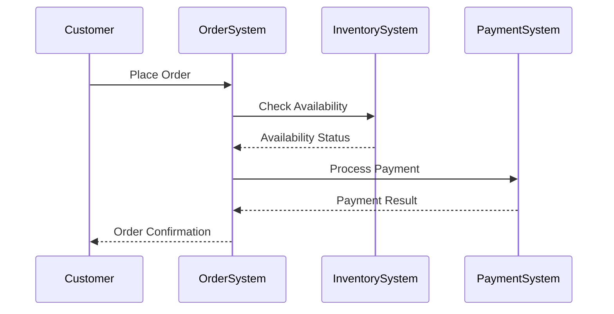
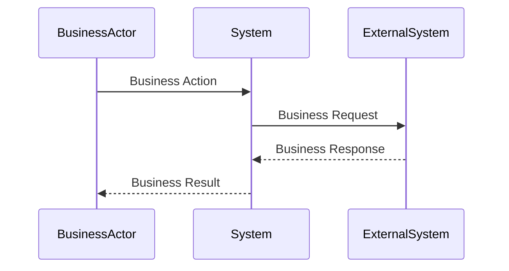
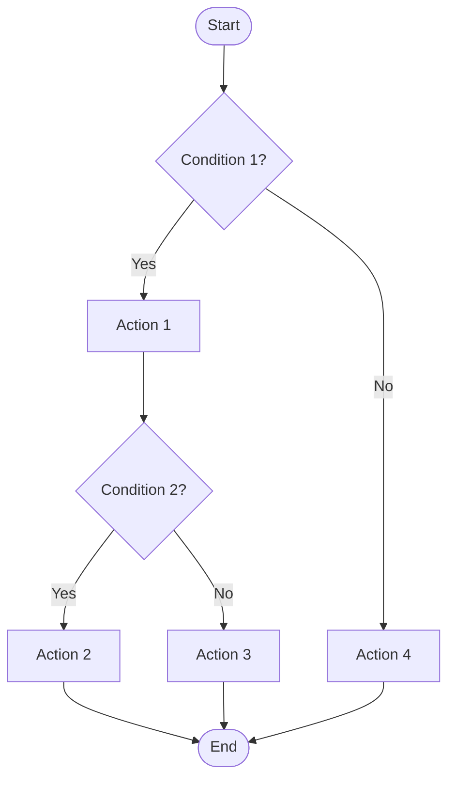
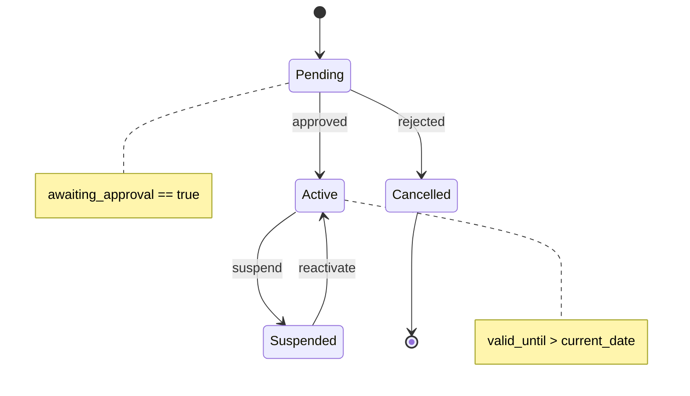
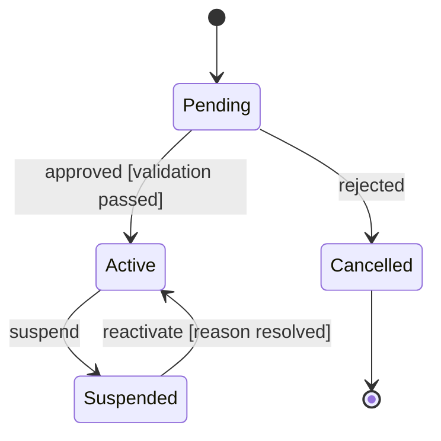
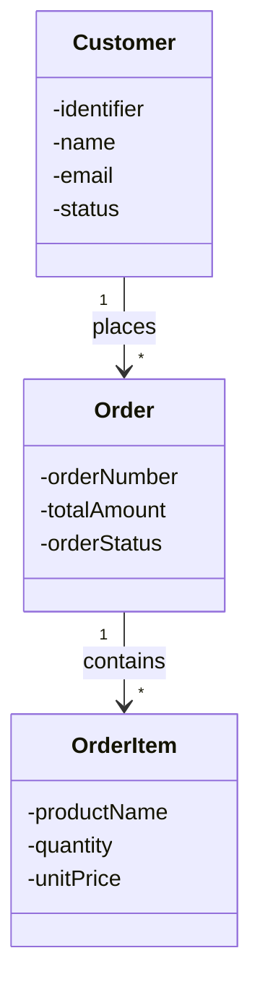
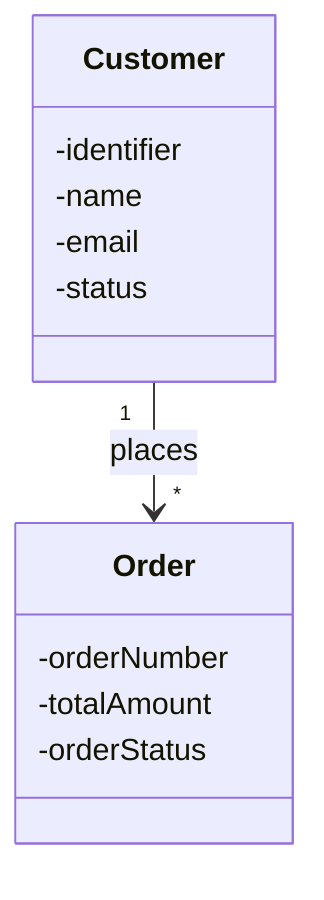
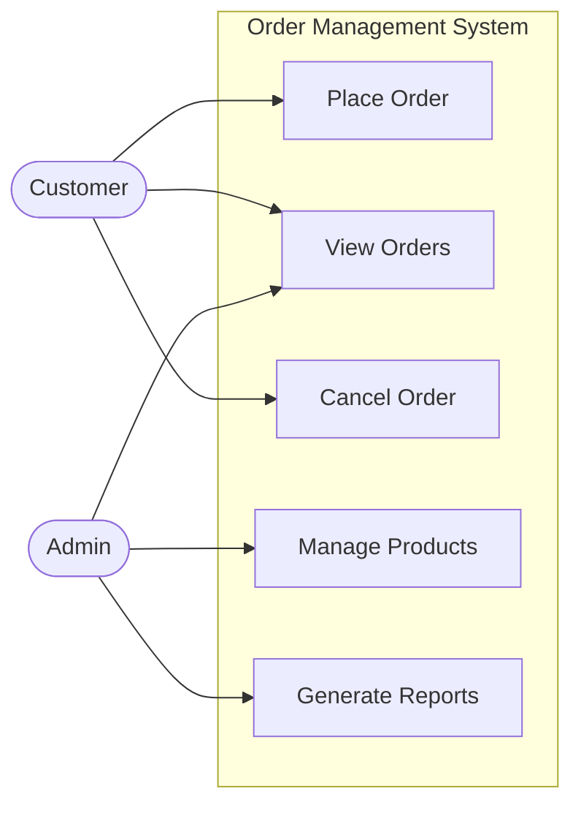

# Business Flow Diagrams for Functional Specification

This document provides guidance on creating diagrams from pseudocode analysis to visualize **business processes, workflows, and functional behavior**. Focus is on illustrating WHAT the system does from a business perspective, not HOW it's technically implemented.

## When to Use Diagrams

**Use diagrams to clarify business logic:**

- Complex business workflows with multiple decision paths
- Business entity relationships and data requirements
- Business interactions between systems/actors
- Business state transitions and lifecycle
- Business process flows

**Don't overuse:**

- Simple linear business processes (plain text is clearer)
- When pseudocode already clearly expresses business logic
- For technical implementation details (architecture, deployment, etc.)
- When documenting technical rather than functional aspects

## Diagram Types and Use Cases

## 1. Sequence Diagram

**Use for:** Business interaction flows, actor communications, business message passing

**When to extract from pseudocode:**

```
businessActor performs action
system validates with businessRule
system queries businessData
system notifies externalParty
```

**Mermaid Notation:**



**Markdown Format:**

````markdown
## Sequence Diagram: [Business Process Name]


````

**Key Elements:**

- Participants: Business actors, systems, external parties
- Messages: Business actions and requests
- Return messages: Business responses and results
- Focus on business meaning, not technical protocols

**When to extract from pseudocode:**

```
if condition1:
  action1()
  if condition2:
    action2()
  else:
    action3()
else:
  action4()
```

**Mermaid Flowchart:**



**Markdown Format:**

````markdown
## Activity Diagram: [Process Name]

```mermaid
flowchart TD
    Start([Start])
    Cond1{Condition 1?}
    Action1[Action 1]
    Action2[Action 2]
    End([End])
    
    Start --> Cond1
    Cond1 -->|Yes| Action1
    Cond1 -->|No| Action2
    Action1 --> End
    Action2 --> End
````

**Key Elements:**

- Start/End nodes: `([Start])`, `([End])`
- Activities: `[Action]`
- Decisions: `{Condition?}` with labeled edges
- Flow direction: `TD` (top-down), `LR` (left-right)
- Parallel flows: Use subgraphs or multiple paths

### 3. State Machine Diagram

**Use for:** Entity lifecycle, status transitions, mode changes

**When to extract from pseudocode:**

```
if state == "pending":
  if approved:
    state = "active"
  if rejected:
    state = "cancelled"
else if state == "active":
  if suspend:
    state = "suspended"
```

**Mermaid State Diagram:**



**Markdown Format:**

````markdown
## State Machine: [Entity Name]



**States:**
- Pending: Initial state after creation
- Active: Normal operational state
- Suspended: Temporarily disabled
- Cancelled: Terminal state (cannot transition out)

**Transitions:**
- Pending → Active: Event = approved, Guard = validation passed
- Pending → Cancelled: Event = rejected
- Active → Suspended: Event = suspend
- Suspended → Active: Event = reactivate, Guard = reason resolved

**State Invariants:**
- Pending: awaiting_approval == true
- Active: valid_until > current_date
- Suspended: suspension_reason must be set
````

**Key Elements:**

- Initial state: `[*]`
- Final state: `[*]` at end of transition
- States: Named automatically from transitions
- Transitions: `State1 --> State2: event [guard]`
- Notes: `note right of State` for annotations

### 4. Class Diagram (Business Data Model)

**Use for:** Business entity relationships, business data structures, business object hierarchies

**When to extract from pseudocode:**

```
entity Order:
  id, customer, items, total, status
  
entity OrderItem:
  product, quantity, price

entity Customer:
  id, name, email, status
```

**Mermaid Class Diagram:**



**Markdown Format:**

````markdown
## Business Entity Diagram: [Domain Name]



### Business Entities

**Customer**
- Business Attributes:
  - identifier: Unique customer identifier
  - name: Customer full name (required)
  - email: Contact email (must be unique)
  - status: Account status (active, inactive, suspended)

**Order**
- Business Attributes:
  - orderNumber: Unique order identifier
  - totalAmount: Total order value in currency
  - orderStatus: Current order state (pending, confirmed, shipped, delivered)
- Business Relationships:
  - Placed by exactly one Customer
  - Contains one or more OrderItems
````

**Relationship Types in Mermaid:**

- Association: `-->` General relationship
- Aggregation: `o--` Has-a (shared lifetime)
- Composition: `*--` Part-of (exclusive lifetime)
- Inheritance: `<|--` Is-a (extends)
- Dependency: `..>` Uses
- Cardinality: `"1" --> "*"` (one-to-many)

### 5. Use Case Diagram (Business Capabilities)

**Use for:** Business functionality, user interactions, business feature scope

**When to extract from pseudocode:**

```
if user.isCustomer():
  can: placeOrder, viewOrders, cancelOrder
if user.isAdmin():
  can: manageProducts, viewAllOrders, generateReports
```

**Mermaid Flowchart (Use Case Alternative):**



**Note:** Mermaid doesn't have a dedicated use case diagram type. Use flowcharts or document use cases in structured markdown.

**Markdown Format:**

```markdown
## Use Case Diagram: [System Name]

### Business Actors
- **Customer**: End user who purchases products
- **Admin**: System administrator

### Business Use Cases

**Place Order** (Customer)
- Business Purpose: Customer creates new order
- Business Precondition: Customer authenticated, items selected
- Business Postcondition: Order created, inventory reserved

**View Orders** (Customer, Admin)
- Business Purpose: View order history and status
- Business Precondition: Authenticated user
- Business Postcondition: Order list displayed

**Cancel Order** (Customer)
- Business Purpose: Customer cancels pending order
- Business Precondition: Order exists and is cancellable
- Business Postcondition: Order cancelled, inventory released

**Manage Products** (Admin only)
- Business Purpose: Add, edit, or remove products
- Business Precondition: Admin authentication
- Business Postcondition: Product catalog updated

**Generate Reports** (Admin only)
- Business Purpose: Create business and operational reports
- Business Precondition: Admin authentication
- Business Postcondition: Report generated
```

## Diagram Creation Guidelines

### Choosing the Right Diagram

| Need to Show | Use This Diagram |
| -------------- | ------------------ |
| Business interactions between actors | Sequence Diagram (sequenceDiagram) |
| Business process flow | Flowchart (flowchart TD/LR) |
| Business entity lifecycle | State Diagram (stateDiagram-v2) |
| Business data relationships | Class Diagram (classDiagram) |
| Business user capabilities | Flowchart or User Journey |

### Best Practices

**Keep it Simple:**

- One diagram per business concept
- Maximum 7-10 elements per diagram
- Break complex business flows into multiple views

**Be Consistent:**

- Use standard Mermaid syntax
- Consistent business terminology
- Same level of business abstraction throughout

**Add Business Context:**

- Title clearly describes the business process shown
- Use notes for business rules and constraints
- Brief description of diagram's business purpose

**Focus on Business Clarity:**

- Prioritize business readability over technical completeness
- Use proper direction (TD, LR, etc.)
- Label transitions and relationships with business meaning

## Integration with Functional Specifications

**Link Diagrams to Functional Requirements:**

````markdown
## FR-010: Order Processing

See [Business Flow Diagram: Order Processing](#sequence-diagram-order-processing)

[Detailed functional requirement text...]
````

**Embed in Specification Sections:**

- Business Overview: Use Case Diagram or Business Journey
- Business Workflow: Flowchart or Sequence Diagram
- Business Data Requirements: Class Diagram
- Business State Management: State Diagram

**Traceability:**

- Reference diagram elements in functional requirements
- Link diagram components to FR and BR IDs
- Version diagrams with functional specifications

## Why Use Business Flow Diagrams?

**Benefits for Functional Specifications:**

- Clarify complex business logic visually
- Show business decision points clearly
- Illustrate business entity relationships
- Document business state transitions
- Communicate business processes to stakeholders

**When to Use:**

- Functional specifications
- Business requirements documents
- README files documenting business capabilities
- Business process documentation
- Stakeholder communication materials

**When NOT to Use:**

- Technical architecture documentation
- Implementation guides
- Deployment diagrams
- Technical design documents
- Performance analysis
